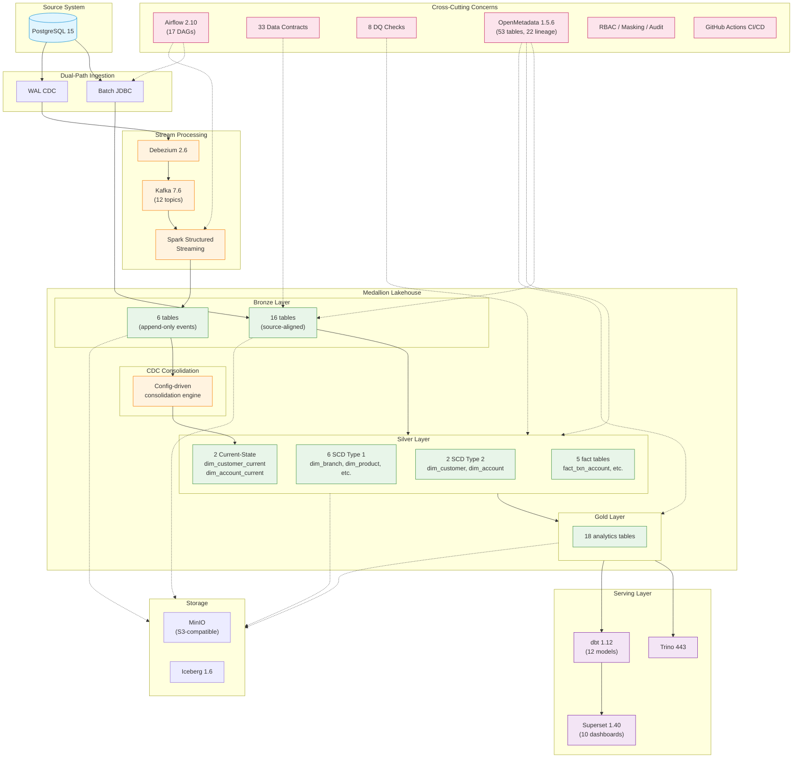

# Banking Data Platform

<p align="center">
  <strong>End-to-End Batch & Real-Time Lakehouse Architecture for Banking Analytics</strong>
</p>

<p align="center">
  Apache Spark · Apache Iceberg · MinIO · Apache Airflow · Debezium · Kafka · Trino · dbt · OpenMetadata · Apache Superset
</p>

<p align="center">
  <a href="https://github.com/minzi03/banking_data_platform/actions">
    
  </a>
  
  
  
  
  
</p>

---

## What is this project?

**Banking Data Platform** is a production-like data engineering project that implements dual-path ingestion for banking workloads: scheduled batch processing through a Bronze–Silver–Gold lakehouse and near-real-time CDC ingestion using Debezium, Kafka, and Spark Structured Streaming.

The platform combines Apache Iceberg/MinIO storage, Airflow orchestration, Trino/dbt serving, OpenMetadata governance, and Superset analytics.

---

## Architecture



---

## Key Capabilities

| Capability | Status |
|------------|--------|
| Batch ingestion from PostgreSQL | ✅ Implemented |
| Bronze → Silver → Gold transformation | ✅ Implemented |
| CDC connector registration | ✅ Implemented |
| Kafka-to-Iceberg raw CDC ingestion | ✅ Implemented |
| CDC consolidation into Silver current-state | ✅ Implemented |
| Dead Letter Queue for invalid events | ✅ Implemented |
| Data quality and governance workflows | ✅ Implemented |
| OpenMetadata catalog and lineage | ✅ Implemented |
| dbt semantic layer | ✅ Implemented |
| Apache Superset analytics dashboard | ✅ Implemented |
| Prometheus + Grafana monitoring | ✅ Implemented |

---

## Batch Pipeline

```text
PostgreSQL → Spark JDBC → Bronze Batch (16) → Silver (13) → Gold (18) → Trino/dbt/Superset
```

### Data Flow

```text
Synthetic Data Generator
        │
        ▼
PostgreSQL 15
        │
        ▼
Spark JDBC Batch Ingestion
        │
        ▼
Bronze Iceberg Tables
        │
        ▼
Spark SCD1 / SCD2 / Fact Jobs
        │
        ▼
Silver Iceberg Tables
        │
        ▼
Spark Gold Mart Jobs
        │
        ▼
Gold History + Current-Serving Tables
        │
        ├──► Trino
        ├──► dbt
        └──► Apache Superset
```

---

## CDC Pipeline

```text
PostgreSQL → Debezium → Kafka → Spark Streaming → Bronze CDC (6 tables)
```

### Data Flow

```text
PostgreSQL WAL
        │
        ▼
Debezium Connect
        │
        ▼
Apache Kafka
        │
        ▼
Spark Structured Streaming
        │
        ▼
Bronze CDC Iceberg Tables
(append-only change history)
        │
        ▼
CDC Consolidation Engine
(config-driven, idempotent)
        │
        ▼
Silver Current-State Tables
├── dim_customer_current
└── dim_account_current
```

CDC tables retain:
- Normalized operation type (INSERT/UPDATE/DELETE/SNAPSHOT)
- Event timestamp
- Kafka topic, partition, offset
- Spark batch ID
- Ingestion timestamp

### CDC Current-State Consolidation

Selected high-value CDC entities are incrementally consolidated from
append-only Bronze CDC tables into mutable Silver current-state tables:

- `bronze.core_customer_cdc` → `silver.dim_customer_current`
- `bronze.core_account_cdc` → `silver.dim_account_current`

The consolidation engine is config-driven and applies deterministic
deduplication, INSERT/UPDATE/DELETE handling, persisted watermarks,
and idempotent Iceberg MERGE processing.

Runtime verification confirmed:
- 10,000 unique customer current-state rows
- 30,000 unique account current-state rows
- INSERT / UPDATE / DELETE handling
- restart-safe watermark persistence
- duplicate-free idempotent reprocessing
- source-to-Silver freshness of 22–54 seconds across five local trials

Bronze CDC remains append-only for audit and replay, while Silver Current
provides the latest derived operational state.

### Dead Letter Queue (DLQ)

Invalid CDC events are isolated without failing the entire micro-batch:

```text
Spark Micro-Batch
    │
    ▼
Validate Events (3 criteria)
    │
    ├── Valid Events ──► Bronze CDC Table
    │
    └── Invalid Events ──► DLQ Table (cdc_dead_letter)
```

**Validation Criteria:**
1. `__op` field is present and valid (c, u, d, r)
2. `__ts_ms` field is parseable as numeric timestamp
3. Event payload is non-null

**DLQ Table Schema:**
- `source_topic` — Kafka topic name
- `entity` — Target entity (customer, account, etc.)
- `raw_payload` — Original invalid JSON
- `error_type` — INVALID_OPERATION, INVALID_TIMESTAMP, NULL_PAYLOAD
- `error_message` — Human-readable error description
- `event_timestamp`, `kafka_partition`, `kafka_offset`, `kafka_timestamp`
- `failed_at` — Timestamp when event was routed to DLQ
- `spark_batch_id` — Batch ID for traceability

**Runtime Verification:**
- Injected 5 valid + 2 invalid CDC events
- 5 valid events written to Bronze ✅
- 2 invalid events isolated in DLQ ✅
- Job completed without crash ✅
- Error details captured: `__op is null`, `Unknown __op=x`

---

## Medallion Data Model

### Bronze Layer

| Type | Count | Description |
|------|-------|-------------|
| Batch | 16 | Source-aligned raw tables |
| CDC | 6 | Append-only change events |

### Silver Layer

| Type | Count | Description |
|------|-------|-------------|
| SCD Type 2 | 2 | dim_customer, dim_account (historical tracking) |
| SCD Type 1 | 6 | dim_branch, dim_product, dim_card, dim_employee, dim_device, dim_location |
| Facts | 5 | fact_txn_account, fact_card_txn, fact_online_transaction, fact_crm_interaction, fact_support_ticket |

### Gold Layer

| Type | Count | Description |
|------|-------|-------------|
| History | 9 | Daily snapshot tables (mart_customer_360, rfm_segment, etc.) |
| Current | 9 | Latest-state serving tables for dashboards |

---

## Analytics Outputs

### Customer 360

Combines customer profile, KYC status, account portfolio, card portfolio, deposits, loans, AUM, recent transactions, RFM segment, churn risk, and cross-sell indicators.

### Business Marts

- **RFM Segmentation**: Customer value classification
- **Churn Risk Scoring**: Rule-based churn-risk assessment
- **AUM Distribution**: Assets under management buckets
- **Cross-sell Opportunities**: Product recommendation candidates
- **Campaign Targets**: Marketing campaign target lists

### Superset Dashboards

10 analytics pages: Executive Overview, Customer 360, RFM Analysis, Churn Risk, Campaign Target, Balance and AUM, Card Analytics, Transaction Analytics, Raw Data Explorer, About and Architecture.

---

## Governance & Security

### Data Contracts

33 YAML contracts define schema expectations, ownership, freshness SLA, and business rules for each dataset.

### Data Quality

8 check types: row_count, null_check, unique_check, range_check, referential_integrity, anomaly_detection, freshness_check, schema_drift.

### PII Protection

- Sensitive-column classification and masking
- Sandbox-safe datasets
- PII tags in OpenMetadata

### Lineage & Audit

- Dataset dependencies tracked across Bronze → Silver → Gold
- Pipeline runs, processing logs, audit events
- 53 tables registered in OpenMetadata with 22 lineage edges

---

## Orchestration & CI/CD

### Airflow (17 DAGs)

| Time | Workflow | Description |
|------|----------|-------------|
| 02:00 | Bronze DAGs | Ingest raw data from PostgreSQL |
| 04:00 | Silver DAGs | Clean, conform, apply SCD processing |
| 06:00 | Gold DAGs | Build business marts |
| 07:00 | dbt DAGs | Run semantic models and tests |
| 08:00 | Ops DAGs | Data quality and PII masking |
| Sunday 03:00 | Maintenance | Iceberg cleanup and optimization |

### CI/CD (GitHub Actions)

- Ruff linting
- YAML validation
- 262 tests (pytest)
- Coverage reporting
- Docker image build and push to GHCR

---

## Demo

See [docs/demo/demo.md](docs/demo/demo.md) for a 5-minute walkthrough.

### Quick Query Examples

```bash
# Customer 360 count
docker exec banking-trino trino \
  --catalog lakehouse \
  --execute "SELECT COUNT(*) FROM gold.mart_customer_360"

# RFM distribution
docker exec banking-trino trino \
  --catalog lakehouse \
  --execute "
    SELECT rfm_segment, COUNT(*) AS customer_count
    FROM gold.rfm_segment
    GROUP BY rfm_segment
    ORDER BY customer_count DESC
  "
```

---

## How to Run

### Prerequisites

- Docker Desktop
- 16 GB RAM (14 GB allocated to Docker)
- Git
- Python 3.11+

### Quick Start

```bash
# 1. Clone
git clone https://github.com/minzi03/banking_data_platform.git
cd banking_data_platform

# 2. Configure
cp docker/.env.example docker/.env

# 3. Start infrastructure
cd docker
docker compose up -d

# 4. Generate seed data
python data_generator/generate_all.py --host localhost --port 5432

# 5. Run pipelines
# Open Airflow (http://localhost:8080) and trigger DAGs in order
```

### Service Endpoints

| Service | URL | Credentials |
|---------|-----|-------------|
| Airflow | http://localhost:8080 | admin / admin |
| MinIO | http://localhost:9001 | minioadmin / Minioadmin123 |
| Spark UI | http://localhost:9090 | — |
| Trino | http://localhost:8085 | — |
| PostgreSQL | localhost:5432 | banking_admin / BankingAdmin123 |
| OpenMetadata | http://localhost:8585 | admin / admin |
| Superset | http://localhost:8501 | — |
| Kafka UI | http://localhost:8081 | — |

---

## Current Limitations

- Spark cluster: 1 master + 1 worker (single-node)
- Airflow: local production-like config (not distributed HA)
- Churn logic: rule-based risk scoring (not ML model)
- Observability: distributed across service-native UIs (no centralized monitoring)
- Default credentials for local development only

---

## Roadmap

### P0: Portfolio Polish (Current)

- [x] Architecture diagram
- [x] README rewrite
- [ ] Demo script (5 minutes)
- [ ] Interview talking points
- [ ] Evidence screenshots

### P1: CDC Consolidation ✅

- [x] Bronze CDC → Silver Current State (customer + account)
- [x] Config-driven consolidation engine
- [x] Composite watermark for incremental processing
- [x] Deduplication, ordering, restart recovery
- [x] INSERT/UPDATE/DELETE handling verified
- [x] Idempotent reprocessing verified
- [x] Latency measured: 22–54s source-to-Silver

### P2: Basic Observability ✅

- [x] Prometheus + Grafana deployment
- [x] Custom freshness exporter (Trino → Prometheus)
- [x] Dashboard: Trino health, row counts, CDC freshness, error rate
- [x] Red threshold at 3600s (1 hour) for freshness alerts

### P3: DLQ / Error Handling ✅

- [x] Dead Letter Queue as Iceberg table (`cdc_dead_letter`)
- [x] 3-criteria validation (op, timestamp, payload)
- [x] Invalid events routed to DLQ with error context
- [x] Valid events continue processing to Bronze
- [x] Runtime test verified: 5 valid → Bronze, 2 invalid → DLQ
- [x] Job completes without crash on malformed events

### Optional / Parking Lot

- Schema Registry
- Advanced Iceberg maintenance
- DR drill
- Cloud deployment
- ML / Feature Store
- Data Mesh

---

## Technology Stack

| Component | Version | Role |
|-----------|---------|------|
| PostgreSQL | 15 | Source OLTP database |
| Apache Spark | 3.5.3 | Batch + streaming compute |
| Apache Iceberg | 1.6 | ACID table format |
| MinIO | latest | S3-compatible object storage |
| Iceberg REST Catalog | 1.6 | Shared catalog (Spark + Trino) |
| Trino | 443 | Interactive SQL query engine |
| Apache Airflow | 2.10.0 | Workflow orchestration |
| Debezium | 2.6 | Change Data Capture |
| Apache Kafka | 7.6 | Event streaming |
| OpenMetadata | 1.5.6 | Catalog, lineage, governance |
| dbt Core | 1.12.0 | Semantic models + tests |
| Apache Superset | 1.40.0 | Analytics dashboards |
| Docker Compose | — | Local deployment |

---

## License

MIT
