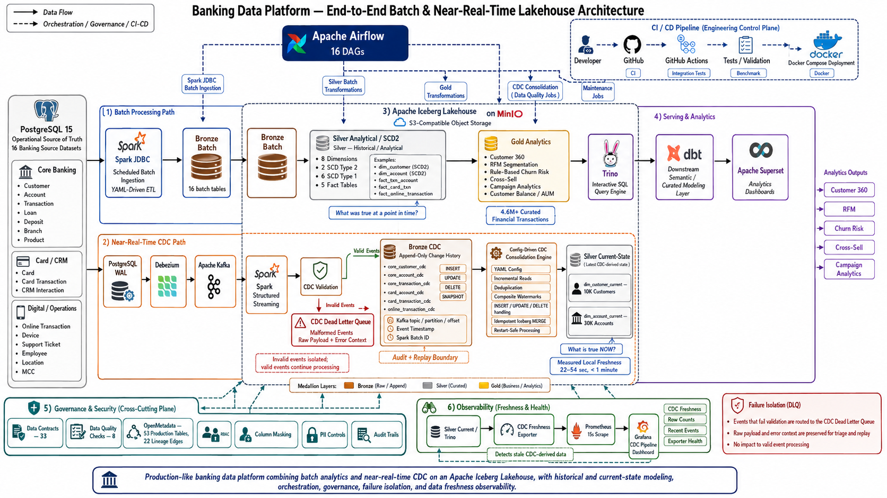

# Banking Data Platform

<p align="center">
  <strong>End-to-End Batch & Near-Real-Time Lakehouse Architecture for Banking Analytics</strong>
</p>

<p align="center">
  Apache Spark · Apache Iceberg · MinIO · Apache Airflow · Debezium · Kafka · Trino · dbt · OpenMetadata · Apache Superset
</p>

<p align="center">
  <a href="https://github.com/minzi03/banking_data_platform/actions">
    
  </a>
  
  
  
  
  
</p>

---

## What is this project?

**Banking Data Platform** is a production-like data engineering project that implements two complementary ingestion paths for banking workloads:

- **Scheduled batch processing** through a Bronze → Silver → Gold Medallion Lakehouse.
- **Near-real-time Change Data Capture (CDC)** using PostgreSQL WAL, Debezium, Kafka, and Spark Structured Streaming.

The platform combines:

- **Apache Spark** for batch and streaming processing
- **Apache Iceberg + MinIO** for lakehouse storage
- **Apache Airflow** for orchestration
- **Trino + dbt + Apache Superset** for analytical serving
- **OpenMetadata** for catalog, lineage, and governance
- **Prometheus + Grafana** for CDC freshness observability
- **Dead Letter Queue (DLQ)** handling for malformed CDC events

PostgreSQL remains the **operational source of truth**.

The batch and CDC paths produce different derived representations:

```text
Silver SCD1/SCD2
= historical analytical representation

Silver Current
= latest CDC-derived representation
```

---

# Architecture

<p align="center">
  <a href="docs/images/banking_data_platform_architecture_3.png">
    
  </a>
</p>

<p align="center">
  <em>
    End-to-end architecture showing scheduled batch analytics,
    near-real-time CDC, Apache Iceberg Lakehouse processing,
    orchestration, governance, analytical serving,
    observability, and failure isolation.
  </em>
</p>

---

## Architecture at a Glance

### Batch Analytics Path

```text
PostgreSQL
    ↓
Spark JDBC
    ↓
Bronze Batch
    ↓
Spark Transformations
    ↓
Silver SCD1/SCD2 + Facts
    ↓
Spark Business Transformations
    ↓
Gold Analytics
    ↓
Trino
   /     \
 dbt    Superset
```

### Near-Real-Time CDC Path

```text
PostgreSQL WAL
    ↓
Debezium
    ↓
Kafka
    ↓
Spark Structured Streaming
    ↓
CDC Validation
   /             \
valid           invalid
  ↓                ↓
Bronze CDC         DLQ
  ↓
CDC Consolidation
  ↓
Silver Current
├── dim_customer_current
└── dim_account_current
```

> **Architecture boundary:**  
> `Silver Current` does **not** currently feed Gold.  
> Gold analytics remain batch-derived in `portfolio-v1.0`.

---

## Technical Architecture

```mermaid
flowchart LR

    %% =========================================================
    %% SOURCE
    %% =========================================================

    subgraph Source["Source System"]
        PG["PostgreSQL 15<br/>Operational Source of Truth<br/>16 Source Datasets"]
    end

    %% =========================================================
    %% BATCH
    %% =========================================================

    subgraph Batch["Scheduled Batch Processing"]
        JDBC["Spark JDBC<br/>YAML-Driven ETL"]
        BST["Spark<br/>Silver Transformations"]
        GST["Spark<br/>Gold Transformations"]
    end

    %% =========================================================
    %% CDC
    %% =========================================================

    subgraph CDC["Near-Real-Time CDC"]
        WAL["PostgreSQL WAL"]
        DEB["Debezium 2.6<br/>3 Connectors"]
        KAF["Kafka<br/>12 CDC Topics"]
        SSS["Spark Structured<br/>Streaming"]
        VAL{"CDC<br/>Validation"}
        CON["Config-Driven CDC Consolidation<br/><br/>Deduplication<br/>Per-Partition Watermarks<br/>Idempotent Iceberg MERGE"]
        DLQ["CDC Dead Letter Queue<br/><br/>Raw Payload<br/>Error Context<br/>Kafka Metadata"]
    end

    %% =========================================================
    %% LAKEHOUSE
    %% =========================================================

    subgraph Lakehouse["Apache Iceberg Lakehouse on MinIO"]

        subgraph Bronze["Bronze Layer"]
            BB["Bronze Batch<br/>16 Source Tables"]
            BC["Bronze CDC<br/>6 Append-Only Tables<br/><br/>INSERT / UPDATE / DELETE / SNAPSHOT"]
        end

        subgraph Silver["Silver Layer"]
            SA["Silver Analytical<br/><br/>8 Dimensions<br/>2 SCD Type 2<br/>6 SCD Type 1<br/>5 Fact Tables"]
            SC["Silver Current-State<br/><br/>dim_customer_current — 10K<br/>dim_account_current — 30K"]
        end

        subgraph Gold["Gold Layer"]
            GA["Gold Analytics<br/>18 Tables<br/><br/>Customer 360<br/>RFM<br/>Rule-Based Churn Risk<br/>Cross-Sell<br/>Campaign Analytics<br/>Customer Balance / AUM"]
        end
    end

    %% =========================================================
    %% SERVING
    %% =========================================================

    subgraph Serving["Serving & Analytics"]
        TRINO["Trino<br/>SQL Query Engine"]
        DBT["dbt<br/>12 Gold Models"]
        SUP["Apache Superset<br/>Dashboards"]
    end

    %% =========================================================
    %% GOVERNANCE
    %% =========================================================

    subgraph Governance["Governance & Security"]
        CTR["33 Data Contracts"]
        DQ["8 Data Quality Checks"]
        OM["OpenMetadata<br/>53 Production Tables<br/>22 Lineage Edges"]
        SEC["RBAC<br/>Column Masking<br/>PII Controls<br/>Audit Trail"]
    end

    %% =========================================================
    %% OBSERVABILITY
    %% =========================================================

    subgraph Observability["Observability"]
        FEX["CDC Freshness Exporter"]
        PRM["Prometheus<br/>15s Scrape"]
        GRF["Grafana<br/>CDC Pipeline Dashboard"]
    end

    %% =========================================================
    %% ORCHESTRATION / CI-CD
    %% =========================================================

    subgraph Ops["Orchestration & CI/CD"]
        AF["Apache Airflow<br/>16 DAGs"]
        GH["GitHub Actions<br/>312 Automated Tests"]
    end

    %% =========================================================
    %% BATCH FLOW
    %% =========================================================

    PG --> JDBC
    JDBC --> BB
    BB --> BST
    BST --> SA
    SA --> GST
    GST --> GA

    %% =========================================================
    %% CDC FLOW
    %% =========================================================

    PG --> WAL
    WAL --> DEB
    DEB --> KAF
    KAF --> SSS
    SSS --> VAL

    VAL -->|valid| BC
    VAL -.->|invalid| DLQ

    BC --> CON
    CON --> SC

    %% =========================================================
    %% SERVING
    %% =========================================================

    GA --> TRINO
    TRINO --> SUP
    DBT -.->|build / test Gold models via Trino| TRINO

    %% =========================================================
    %% ORCHESTRATION
    %% =========================================================

    AF -.-> JDBC
    AF -.-> BST
    AF -.-> GST
    AF -.-> CON
    AF -.-> DQ

    GH -.-> AF

    %% =========================================================
    %% GOVERNANCE
    %% =========================================================

    CTR -.-> BB
    CTR -.-> BC
    CTR -.-> SA
    CTR -.-> SC

    DQ -.-> SA
    DQ -.-> SC
    DQ -.-> GA

    OM -.-> BB
    OM -.-> BC
    OM -.-> SA
    OM -.-> SC
    OM -.-> GA

    SEC -.-> TRINO
    SEC -.-> SA
    SEC -.-> GA

    %% =========================================================
    %% OBSERVABILITY
    %% =========================================================

    SC -.-> TRINO
    TRINO -.-> FEX
    FEX --> PRM
    PRM --> GRF

    %% =========================================================
    %% STYLES
    %% =========================================================

    classDef source fill:#e0e0e0,stroke:#616161,color:#000
    classDef batch fill:#bbdefb,stroke:#1565c0,color:#000
    classDef cdc fill:#ffe0b2,stroke:#ef6c00,color:#000
    classDef bronze fill:#d7ccc8,stroke:#5d4037,color:#000
    classDef silver fill:#f5f5f5,stroke:#9e9e9e,color:#000
    classDef gold fill:#fff9c4,stroke:#f9a825,color:#000
    classDef serving fill:#e1bee7,stroke:#7b1fa2,color:#000
    classDef governance fill:#b2dfdb,stroke:#00796b,color:#000
    classDef observability fill:#c8e6c9,stroke:#2e7d32,color:#000
    classDef dlq fill:#ffcdd2,stroke:#c62828,color:#000
    classDef cicd fill:#c5cae9,stroke:#283593,color:#000

    class PG source
    class JDBC,BST,GST,AF batch
    class WAL,DEB,KAF,SSS,VAL,CON cdc
    class DLQ dlq
    class BB,BC bronze
    class SA,SC silver
    class GA gold
    class TRINO,DBT,SUP serving
    class CTR,DQ,OM,SEC governance
    class FEX,PRM,GRF observability
    class GH cicd
```



For a deeper technical walkthrough, see:

**[docs/architecture/architecture.md](docs/architecture/architecture.md)**

---

# Key Capabilities

| Capability                             | Status         |
| -------------------------------------- | -------------- |
| PostgreSQL batch ingestion             | ✅ Implemented |
| YAML-driven Spark ETL                  | ✅ Implemented |
| Bronze → Silver → Gold processing      | ✅ Implemented |
| SCD Type 1 / Type 2 modeling           | ✅ Implemented |
| Debezium + Kafka CDC                   | ✅ Implemented |
| Spark Structured Streaming             | ✅ Implemented |
| Append-only Bronze CDC                 | ✅ Implemented |
| CDC consolidation into Silver Current  | ✅ Implemented |
| Persisted CDC watermarks               | ✅ Implemented |
| Idempotent Iceberg MERGE               | ✅ Implemented |
| Dead Letter Queue for malformed events | ✅ Implemented |
| Data contracts and Data Quality        | ✅ Implemented |
| OpenMetadata catalog and lineage       | ✅ Implemented |
| Trino + dbt serving layer              | ✅ Implemented |
| Apache Superset analytics              | ✅ Implemented |
| Prometheus + Grafana monitoring        | ✅ Implemented |
| GitHub Actions CI/CD                   | ✅ Implemented |

---

# Verified Portfolio Snapshot

| Category          | Metric                         | Verified Value |
| ----------------- | ------------------------------ | -------------: |
| **Source**        | Source datasets                |             16 |
| **Bronze**        | Batch tables                   |             16 |
|                   | Append-only CDC tables         |              6 |
| **Silver**        | SCD Type 2 dimensions          |              2 |
|                   | SCD Type 1 dimensions          |              6 |
|                   | Fact tables                    |              5 |
|                   | CDC current-state tables       |              2 |
| **Gold**          | Analytics tables               |             18 |
| **Scale**         | Curated financial transactions |          4.6M+ |
| **CDC**           | Debezium connectors            |              3 |
|                   | Kafka CDC topics               |             12 |
| **Serving**       | dbt models                     |             12 |
| **Governance**    | Data contracts                 |             33 |
|                   | Data-quality checks            |              8 |
| **Catalog**       | Production data tables         |             53 |
|                   | Lineage edges                  |             22 |
| **Orchestration** | Airflow DAGs                   |             16 |
| **Testing**       | Automated tests                |            312 |
| **Platform**      | Docker services                |             23 |
| **CDC Current**   | Customer rows                  |         10,000 |
|                   | Account rows                   |         30,000 |
| **CDC Freshness** | Median local E2E               |          49.8s |
|                   | Local E2E range                |     22.4–54.0s |

---

# Batch Pipeline

## Data Flow

```text
PostgreSQL
    ↓
Spark JDBC
    ↓
Bronze Batch
    ↓
Spark Transformations
    ↓
Silver Dimensions + Facts
    ↓
Spark Business Transformations
    ↓
Gold Analytics
    ↓
Trino / dbt / Superset
```

Batch ingestion is driven by reusable YAML configuration and Spark ETL jobs.

---

## Bronze Batch

The Bronze Batch layer stores source-aligned data ingested through PostgreSQL JDBC.

It provides a stable landing layer for:

- validation
- schema enforcement
- downstream transformation
- backfills
- reprocessing

```text
PostgreSQL
    ↓
Spark JDBC
    ↓
Bronze Batch
```

---

## Silver Analytical Model

The batch Silver layer contains:

- **8 dimensions**
  - 2 SCD Type 2
  - 6 SCD Type 1
- **5 fact tables**

### SCD Type 2

- `dim_customer`
- `dim_account`

### SCD Type 1

- `dim_branch`
- `dim_product`
- `dim_card`
- `dim_employee`
- `dim_device`
- `dim_location`

### Fact Tables

- `fact_txn_account`
- `fact_card_txn`
- `fact_online_transaction`
- `fact_crm_interaction`
- `fact_support_ticket`

The main transaction facts contain more than:

```text
4.6M+ curated financial transaction records
```

---

## SCD Type 2 Semantics

SCD Type 2 preserves historical versions of business entities.

Example:

```text
customer_id = 1001

Version 1
segment = MASS
valid_from = Jan
valid_to = Jun

Version 2
segment = PRIORITY
valid_from = Jul
valid_to = current
```

This enables questions such as:

> What customer state was valid when a historical business event occurred?

In short:

```text
Silver SCD2
= What was true then?
```

---

# Gold Analytics

Gold is produced from the **batch Silver analytical model**.

Current portfolio baseline:

```text
18 Gold analytics tables
```

Representative outputs include:

- Customer 360
- RFM Segmentation
- Rule-Based Churn-Risk Scoring
- Customer Balance / AUM Analytics
- Cross-Sell Analytics
- Campaign Analytics
- Customer Product Summaries
- Customer Transaction Summaries
- Branch-Level Analytics

> Gold remains batch-derived in the current architecture.

---

# CDC Pipeline

## Data Flow

```text
PostgreSQL WAL
    ↓
Debezium
    ↓
Kafka
    ↓
Spark Structured Streaming
    ↓
CDC Validation
   /             \
valid           invalid
  ↓                ↓
Bronze CDC         DLQ
  ↓
CDC Consolidation
  ↓
Silver Current
```

CDC provides a near-real-time change stream without repeatedly scanning entire PostgreSQL tables.

---

## CDC Components

- PostgreSQL WAL
- Debezium 2.6
- 3 Debezium connectors
- 12 Kafka CDC topics
- Spark Structured Streaming
- 6 append-only Bronze CDC tables
- CDC validation
- CDC Dead Letter Queue
- Config-driven Silver Current consolidation

---

# Bronze CDC

Bronze CDC preserves source changes as **append-only change history**.

Representative datasets:

- `core_customer_cdc`
- `core_account_cdc`
- `core_transaction_cdc`
- `card_account_cdc`
- `card_transaction_cdc`
- `online_transaction_cdc`

CDC records retain metadata including:

- normalized CDC operation
- event timestamp
- Kafka topic
- Kafka partition
- Kafka offset
- Spark batch ID
- ingestion metadata

### Change Operations

```text
SNAPSHOT
INSERT
UPDATE
DELETE
```

Example:

```text
customer_id = 1001

09:00 SNAPSHOT email=a@example.com
10:00 UPDATE   email=b@example.com
11:00 UPDATE   email=c@example.com
```

All events remain available in Bronze CDC.

> **Bronze CDC = audit + replay boundary**

---

# CDC Current-State Consolidation

Selected CDC entities are incrementally consolidated into Silver latest-state representations.

```text
bronze.core_customer_cdc
        ↓
cdc_consolidation.py
        ↓
silver.dim_customer_current
```

```text
bronze.core_account_cdc
        ↓
cdc_consolidation.py
        ↓
silver.dim_account_current
```

The same generic engine is reused with different YAML configurations.

---

## Consolidation Responsibilities

The engine performs:

- incremental CDC reads
- business-key deduplication
- per-partition persisted progress tracking
- INSERT handling
- UPDATE handling
- DELETE handling
- SNAPSHOT handling
- idempotent Iceberg MERGE
- restart-safe reprocessing

---

## Verified Current-State Tables

| Bronze CDC Source          | Silver Current Target         |   Rows |
| -------------------------- | ----------------------------- | -----: |
| `bronze.core_customer_cdc` | `silver.dim_customer_current` | 10,000 |
| `bronze.core_account_cdc`  | `silver.dim_account_current`  | 30,000 |

Current-state semantics:

```text
1 business key
      ↓
1 latest row
```

In short:

```text
Silver Current
= What is true now?
```

---

# Silver SCD2 vs Silver Current

The two representations intentionally serve different requirements.

| Property              | Silver SCD2           | Silver Current            |
| --------------------- | --------------------- | ------------------------- |
| Source path           | Batch                 | CDC                       |
| Purpose               | Historical analytics  | Latest consolidated state |
| Rows per business key | Multiple versions     | One                       |
| History               | Preserved             | Latest state only         |
| Freshness             | Batch-cycle dependent | CDC-derived               |
| Example               | `dim_customer`        | `dim_customer_current`    |
| Main question         | What was true then?   | What is true now?         |

Example:

### SCD Type 2

```text
customer_sk | customer_id | segment  | valid_from | valid_to | current
------------|-------------|----------|------------|----------|--------
SK01        | 1001        | MASS     | Jan        | Jun      | 0
SK02        | 1001        | PRIORITY | Jul        | NULL     | 1
```

### Silver Current

```text
customer_id | segment
------------|---------
1001        | PRIORITY
```

Both are derived representations.

PostgreSQL remains the operational source of truth.

---

# Watermark & Restart Recovery

CDC consolidation stores processing progress per:

```text
table_name
+ kafka_topic
+ kafka_partition
```

Conceptually:

```text
customer / topic / partition 0 → offset 1500
customer / topic / partition 1 → offset 921
```

Kafka offsets are meaningful only **within the same partition**.

Therefore the consolidation process tracks progress independently per partition.

### Watermark Benefits

- incremental processing
- restart recovery
- reduced rescanning
- partition-specific progress
- replay-safe failure handling

The watermark does **not** create global ordering across Kafka partitions.

---

## Failure Recovery

Processing order:

```text
Read CDC
    ↓
Deduplicate
    ↓
MERGE Silver Current
    ↓
Successful?
    ↓
Advance Watermark
```

Consider:

```text
Silver MERGE succeeds
        ↓
process crashes
        ↓
watermark not updated
```

After restart:

```text
old watermark
    ↓
same events read again
    ↓
idempotent MERGE
    ↓
same final Silver state
    ↓
watermark advances
```

The system therefore supports:

> **checkpointed, replay-safe, idempotent processing**

It does **not** claim end-to-end exactly-once semantics.

---

# CDC Freshness Verification

Five local runtime trials measured the time from a PostgreSQL source change until the resulting state became visible in Silver Current.

|      Trial | Source → Silver |
| ---------: | --------------: |
|          1 |           28.2s |
|          2 |           54.0s |
|          3 |           51.1s |
|          4 |           22.4s |
|          5 |           49.8s |
| **Median** |       **49.8s** |

Summary:

```text
Trials : 5
Range  : 22.4–54.0 seconds
Median : 49.8 seconds
```

All five local trials completed in under one minute.

> **Measured local source-to-Silver freshness: < 1 minute**

This is a local verification benchmark, not a production SLA.

Evidence:

**[docs/evidence/p1-cdc-consolidation/](docs/evidence/p1-cdc-consolidation/)**

---

# Dead Letter Queue

Malformed CDC events are isolated instead of failing the entire micro-batch.

```text
Kafka Events
     ↓
Validation
   /          \
valid        invalid
  ↓             ↓
Bronze CDC     CDC DLQ
```

## Validation Criteria

1. `__op` exists and is one of `c`, `u`, `d`, `r`
2. `__ts_ms` is numeric / parseable
3. payload is non-null

---

## DLQ Metadata

The Iceberg `cdc_dead_letter` table stores fields such as:

- `source_topic`
- `entity`
- `raw_payload`
- `error_type`
- `error_message`
- `event_timestamp`
- `kafka_partition`
- `kafka_offset`
- `kafka_timestamp`
- `failed_at`
- `spark_batch_id`

---

## Runtime Verification

Test input:

```text
5 valid events
2 invalid events
```

Result:

```text
5 valid   → Bronze CDC ✅
2 invalid → CDC DLQ    ✅
Streaming job completed without crash ✅
```

Verified invalid examples:

```text
__op is null
Unknown __op = x
```

---

# Medallion Data Model

## Bronze

| Type  | Count | Description                 |
| ----- | ----: | --------------------------- |
| Batch |    16 | Source-aligned batch tables |
| CDC   |     6 | Append-only change history  |

## Silver

| Type              | Count | Description                                       |
| ----------------- | ----: | ------------------------------------------------- |
| SCD Type 2        |     2 | `dim_customer`, `dim_account`                     |
| SCD Type 1        |     6 | Branch, product, card, employee, device, location |
| Facts             |     5 | Transactional and interaction facts               |
| CDC Current-State |     2 | `dim_customer_current`, `dim_account_current`     |

## Gold

| Type             | Count | Description                      |
| ---------------- | ----: | -------------------------------- |
| Analytics Tables |    18 | Business-facing analytical marts |

---

# Analytics Outputs

The Gold layer is organized around banking customer analytics.

---

## Customer 360

Customer 360 combines information such as:

- customer profile
- KYC context
- account portfolio
- card portfolio
- deposits and loans
- recent transaction behavior
- customer value indicators
- RFM segmentation
- churn-risk signals
- cross-sell indicators

It acts as a foundation for downstream customer analytics.

---

## RFM Segmentation

Behavioral segmentation based on:

- **Recency**
- **Frequency**
- **Monetary Value**

Representative segments include:

- Champions
- Loyal Customers
- Potential Loyalists
- At Risk
- New Customers
- Hibernating

The implementation uses transparent business rules rather than claiming an ML segmentation model.

---

## Rule-Based Churn-Risk Scoring

The project identifies customers with reduced transaction activity using explainable rules.

The implementation is intentionally described as:

```text
rule-based churn-risk scoring
```

rather than an ML churn prediction model.

---

## Customer Balance / AUM Analytics

Aggregates customer balance and financial-value indicators from the available portfolio datasets.

> The project uses a simplified AUM / customer-value representation and does not claim a complete wealth-management AUM calculation.

---

## Cross-Sell Analytics

Identifies product opportunities using signals such as:

- product ownership
- customer balances
- account portfolio
- transaction behavior

The current implementation is rule-based.

---

## Campaign Analytics

Supports analytics such as:

- target population
- response
- conversion
- revenue
- campaign cost
- ROI-oriented reporting

---

# Serving & Analytics

Gold analytical data is queried through Trino.

```text
Gold Iceberg
     ↓
   Trino
   /   \
 dbt   Superset
```

## Trino

Provides interactive SQL access to Iceberg tables.

---

## dbt

dbt is used downstream of the curated Gold layer for:

- analytical models
- incremental models
- tests
- documentation
- semantic transformations

Current baseline:

```text
12 dbt models
```

> Spark remains the primary Bronze → Silver → Gold processing engine.

---

## Apache Superset

Superset provides analytical dashboards over curated data exposed through the serving layer.

---

# Governance & Security

Governance is implemented as a cross-cutting platform capability.

---

## Data Contracts

```text
33 YAML data contracts
```

Contracts define expectations including:

- schema
- field constraints
- ownership
- quality rules
- freshness expectations

---

## Data Quality

```text
8 data-quality check types
```

Examples:

- row-count checks
- null checks
- uniqueness checks
- range checks
- referential integrity
- anomaly checks
- freshness checks
- schema-drift checks

---

## OpenMetadata

Cataloged assets:

```text
53 production data tables
22 lineage edges
```

Capabilities include:

- searchable data catalog
- technical metadata
- lineage
- ownership
- glossary / business metadata

---

## Security Controls

Portfolio security/governance patterns include:

- RBAC
- column masking
- PII classification and controls
- audit trails

These demonstrate governance patterns without claiming full banking regulatory compliance.

---

# Orchestration

Apache Airflow coordinates scheduled and job-oriented workflows.

```text
Apache Airflow
16 DAGs
```

Representative responsibilities:

- Bronze ingestion
- Silver transformations
- Gold transformations
- CDC consolidation
- dbt jobs
- Data Quality
- Iceberg maintenance
- supporting operational workflows

Example batch schedule:

| Time         | Workflow    | Description                           |
| ------------ | ----------- | ------------------------------------- |
| 02:00        | Bronze      | PostgreSQL batch ingestion            |
| 04:00        | Silver      | Clean, conform, SCD / fact processing |
| 06:00        | Gold        | Build analytical marts                |
| 07:00        | dbt         | Gold models and tests                 |
| 08:00        | Ops         | Data Quality / governance workflows   |
| Sunday 03:00 | Maintenance | Iceberg cleanup and optimization      |

> Airflow orchestrates jobs.  
> Spark Structured Streaming processes the continuous Kafka stream.

---

# Observability

The project includes lightweight CDC freshness observability.

```text
Silver Current / Trino
        ↓
CDC Freshness Exporter
        ↓
Prometheus
        ↓
Grafana
```

---

## CDC Freshness Exporter

A custom Python HTTP exporter queries Trino and exposes Prometheus-compatible metrics.

| Metric                               | Description                                  |
| ------------------------------------ | -------------------------------------------- |
| `cdc_freshness_seconds{table="..."}` | Age of latest consolidated CDC-derived state |
| `cdc_row_count{table="..."}`         | Current-state table row count                |
| `cdc_recent_events`                  | Recent Bronze CDC activity                   |
| `exporter_up`                        | Trino / exporter reachability                |

Prometheus scrape interval:

```text
15 seconds
```

---

## Grafana Dashboard

The CDC dashboard includes eight panels.

|   # | Panel                       |
| --: | --------------------------- |
|   1 | Trino Up / Down             |
|   2 | Customer Current-State Rows |
|   3 | Account Current-State Rows  |
|   4 | Recent CDC Events           |
|   5 | CDC Freshness Over Time     |
|   6 | Customer Freshness Now      |
|   7 | Account Freshness Now       |
|   8 | Row Count Over Time         |

Freshness threshold:

```text
3600 seconds = 1 hour
```

Crossing the threshold indicates **stale CDC-derived data requiring investigation**.

It does not by itself prove the pipeline has failed, because the source may simply have had no recent events.

A stronger production implementation could additionally monitor:

```text
latest Bronze event time
-
latest Silver processed event time
```

plus Kafka consumer lag.

Evidence:

**[docs/evidence/p2-observability/](docs/evidence/p2-observability/)**

---

# CI/CD & Testing

GitHub Actions provides automated validation.

```text
Developer
    ↓
GitHub
    ↓
GitHub Actions
    ↓
Tests / Validation
    ↓
Docker Build / Deployment
```

Workflow categories include:

- CI / lint / unit tests
- integration tests
- performance / benchmark validation

Verified baseline:

```text
312 automated tests
```

covering areas such as:

- ETL
- transformation logic
- Data Quality
- governance
- pipeline behavior

---

# Demo

A 5-minute walkthrough is available at:

**[docs/demo/demo.md](docs/demo/demo.md)**

Typical demo flow:

```text
Architecture
    ↓
Docker Services
    ↓
PostgreSQL UPDATE
    ↓
Kafka CDC Event
    ↓
Bronze CDC
    ↓
Silver Current
    ↓
Silver / Gold Analytics
    ↓
Airflow
    ↓
OpenMetadata
    ↓
Superset / Analytics
```

Runtime evidence:

**[docs/evidence/](docs/evidence/)**

---

# Quick Query Examples

## Customer 360

```bash
docker exec banking-trino trino \
  --catalog lakehouse \
  --execute "
    SELECT COUNT(*)
    FROM gold.mart_customer_360
  "
```

---

## RFM Distribution

```bash
docker exec banking-trino trino \
  --catalog lakehouse \
  --execute "
    SELECT
        rfm_segment,
        COUNT(*) AS customer_count
    FROM gold.rfm_segment
    GROUP BY rfm_segment
    ORDER BY customer_count DESC
  "
```

---

## Silver Current Customer

```bash
docker exec banking-trino trino \
  --catalog lakehouse \
  --execute "
    SELECT
        customer_id,
        email,
        __cdc_operation,
        __cdc_timestamp_ms
    FROM silver.dim_customer_current
    WHERE customer_id = 1001
  "
```

---

# How to Run

## Prerequisites

Recommended local environment:

- Docker Desktop
- 16 GB RAM or more
- Git
- Python 3.11+

Because the platform runs multiple services locally, sufficient Docker memory allocation is recommended.

---

## Quick Start

```bash
# Clone repository
git clone https://github.com/minzi03/banking_data_platform.git
cd banking_data_platform

# Configure environment
cp docker/.env.example docker/.env

# Start infrastructure
cd docker
docker compose up -d
```

Generate seed data if required:

```bash
python data_generator/generate_all.py \
  --host localhost \
  --port 5432
```

Then open Airflow and run the required workflows according to their dependencies.

---

# Service Endpoints

| Service                  | URL / Address                 | Role                             |
| ------------------------ | ----------------------------- | -------------------------------- |
| Airflow                  | http://localhost:8080         | Workflow orchestration           |
| MinIO Console            | http://localhost:9001         | Object storage UI                |
| Spark Master UI          | http://localhost:9090         | Spark cluster UI                 |
| Spark Worker UI          | http://localhost:9091         | Spark worker UI                  |
| Kafka UI                 | http://localhost:8081         | Kafka inspection                 |
| Kafka Connect / Debezium | http://localhost:8083         | CDC connector API                |
| Trino                    | http://localhost:8085         | SQL query engine                 |
| Iceberg REST Catalog     | http://localhost:8181         | Iceberg catalog                  |
| OpenMetadata             | http://localhost:8585         | Catalog / lineage                |
| Apache Superset          | http://localhost:8088         | BI dashboards                    |
| Streamlit                | http://localhost:8501         | Additional analytics application |
| Prometheus               | http://localhost:9095         | Metrics                          |
| Grafana                  | http://localhost:3000         | Monitoring dashboard             |
| Freshness Exporter       | http://localhost:9119/metrics | Prometheus metrics               |
| PostgreSQL               | localhost:5432                | Source database                  |
| Kafka                    | localhost:9092                | Event streaming                  |

Local development credentials are configured through:

```text
docker/.env
```

Development defaults should not be reused in a real production environment.

---

# Current Limitations

This repository demonstrates production-oriented data engineering patterns but intentionally remains a local portfolio environment.

Current boundaries include:

- Spark runs as a small local cluster rather than a large distributed deployment.
- Kafka is not deployed as a production HA multi-broker cluster.
- Airflow uses a local production-like configuration rather than distributed HA.
- CDC consolidation currently targets only **customer** and **account**.
- Other CDC datasets remain append-only Bronze history.
- Gold analytics remain batch-derived.
- Churn-risk logic is rule-based rather than an ML prediction model.
- Customer Balance / AUM analytics use a simplified portfolio representation.
- Observability is intentionally lightweight.
- The freshness metric primarily measures data age rather than complete source-to-target processing lag.
- The platform does not claim end-to-end exactly-once semantics.
- Enterprise mTLS, KMS, Kubernetes, multi-region DR, and production on-call/SLO systems are outside the current portfolio scope.

---

# Portfolio Baseline

Feature-frozen release:

**[`portfolio-v1.0`](https://github.com/minzi03/banking_data_platform/releases/tag/portfolio-v1.0)**

```text
P0 ✅ Portfolio Polish
P1 ✅ CDC Consolidation
P2 ✅ Basic Observability
P3 ✅ DLQ / Error Handling
━━━━━━━━━━━━━━━━━━━━━━━━━━━━━━━━━━━━━━
FEATURE FREEZE
```

---

## P0 — Portfolio Polish ✅

- architecture documentation
- architecture image
- README
- 5-minute demo
- interview talking points
- runtime evidence

---

## P1 — CDC Consolidation ✅

- Bronze CDC → Silver Current for customer and account
- generic YAML-configured consolidation engine
- persisted per-partition watermarks
- business-key deduplication
- INSERT / UPDATE / DELETE handling
- restart-safe processing
- idempotent Iceberg MERGE
- measured local source-to-Silver freshness below one minute

---

## P2 — Basic Observability ✅

- custom CDC freshness exporter
- Prometheus
- Grafana
- Silver Current freshness metrics
- row-count metrics
- freshness visualization and thresholds
- runtime evidence

---

## P3 — DLQ / Error Handling ✅

- CDC event validation
- Iceberg dead-letter table
- malformed-event isolation
- valid-event continuation
- runtime verification

---

# Technology Stack

| Component            | Version / Distribution | Role                         |
| -------------------- | ---------------------- | ---------------------------- |
| PostgreSQL           | 15                     | Operational source database  |
| Apache Spark         | 3.5.3                  | Batch + streaming processing |
| Apache Iceberg       | 1.6.0                  | Lakehouse table format       |
| MinIO                | Repository image       | S3-compatible object storage |
| Iceberg REST Catalog | 1.6.x                  | Shared Spark / Trino catalog |
| Apache Airflow       | 2.10.0                 | Workflow orchestration       |
| Debezium             | 2.6                    | Change Data Capture          |
| Confluent Platform   | 7.6                    | Kafka distribution           |
| Apache Kafka Broker  | 3.6.x                  | Event streaming              |
| Trino                | 443                    | Interactive SQL query engine |
| dbt Core             | Repository-pinned      | Gold models and tests        |
| OpenMetadata         | 1.5.6                  | Catalog, lineage, governance |
| Apache Superset      | Repository-pinned      | Analytics dashboards         |
| Prometheus           | Repository-pinned      | Metrics collection           |
| Grafana              | Repository-pinned      | Metrics visualization        |
| Docker Compose       | —                      | Local platform deployment    |

> `Confluent Platform 7.6` is the distribution version and should not be described as `Apache Kafka 7.6`.

---

# Documentation

| Document                                                                   | Purpose                            |
| -------------------------------------------------------------------------- | ---------------------------------- |
| [Architecture](docs/architecture/architecture.md)                          | Detailed technical architecture    |
| [Architecture Image](docs/images/banking_data_platform_architecture_3.png) | Portfolio architecture overview    |
| [Demo](docs/demo/demo.md)                                                  | 5-minute project walkthrough       |
| [Interview Talking Points](docs/interview/talking-points.md)               | Architecture and design discussion |
| [P1 Interview Prep](docs/interview/p1-interview-prep.md)                   | CDC deep-dive questions            |
| [Evidence](docs/evidence/)                                                 | Runtime screenshots                |
| [P1 CDC Evidence](docs/evidence/p1-cdc-consolidation/)                     | CDC consolidation verification     |
| [P2 Observability Evidence](docs/evidence/p2-observability/)               | Observability verification         |

---

# Architecture Principles

### PostgreSQL remains the source of truth

```text
PostgreSQL
= operational source of truth

Silver SCD2
= derived historical representation

Silver Current
= derived latest-state representation
```

---

### Bronze CDC remains append-only

```text
Bronze CDC
= audit + replay boundary
```

---

### Historical and current-state semantics are separated

```text
Silver SCD2
= What was true then?

Silver Current
= What is true now?
```

---

### Spark owns Medallion transformations

```text
Spark
Bronze → Silver → Gold
```

dbt operates downstream on curated Gold analytical models.

---

### Watermarks advance after successful target processing

```text
Read
→ Deduplicate
→ MERGE
→ Success
→ Update Watermark
```

---

### Replay-safe processing over unsupported exactly-once claims

The platform uses:

- Spark checkpoints
- persisted watermarks
- deduplication
- idempotent Iceberg MERGE

It does not claim one globally coordinated exactly-once transaction across PostgreSQL, Debezium, Kafka, Spark, Bronze, Silver, and metadata state.

---

### Control planes stay separate from the data path

Airflow, OpenMetadata, governance, CI/CD, and observability coordinate or inspect the platform.

They do not replace the physical processing flow.

---

# Interview-Ready Summary

> I built a production-like banking data platform with separate scheduled batch and near-real-time CDC paths. The batch pipeline uses Spark, Iceberg, and MinIO to build SCD1/SCD2 dimensions, fact tables, and Gold analytical marts. In parallel, Debezium captures PostgreSQL WAL changes into Kafka, Spark Structured Streaming validates and persists append-only Bronze CDC events, and a config-driven consolidation engine derives customer and account current-state tables using per-partition watermarks, deduplication, and idempotent Iceberg MERGE. The platform also includes Airflow orchestration, Trino/dbt/Superset analytical serving, OpenMetadata governance, Data Quality, DLQ-based error isolation, CI/CD, and lightweight CDC freshness observability.

---

# Release

Portfolio release:

**[`portfolio-v1.0`](https://github.com/minzi03/banking_data_platform/releases/tag/portfolio-v1.0)**

Repository:

**https://github.com/minzi03/banking_data_platform**

---

# License

MIT
