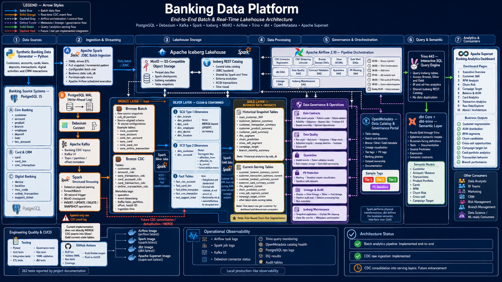

# Banking Data Platform

<p align="center">
  <strong>End-to-End Batch & Real-Time Lakehouse Architecture for Banking Analytics</strong>
</p>

<p align="center">
  Apache Spark · Apache Iceberg · MinIO · Apache Airflow · Debezium · Kafka · Trino · dbt · OpenMetadata · Apache Superset
</p>

<p align="center">
  <a href="https://github.com/minzi03/banking_data_platform/actions">
    
  </a>
  
  
  
  
  
</p>

---

## Overview

**Banking Data Platform** is a production-like data engineering project that demonstrates how a modern bank can ingest, process, govern, query, and serve data across both batch and near-real-time workloads.

The platform implements a Medallion Architecture on Apache Iceberg and MinIO:

```text
PostgreSQL
   │
   ├── Batch JDBC ───────────────► Bronze Batch
   │                                 │
   │                                 ▼
   │                              Silver
   │                                 │
   │                                 ▼
   │                               Gold
   │                                 │
   │                                 ├──► Trino
   │                                 ├──► dbt Semantic Layer
   │                                 └──► Apache Superset Dashboard
   │
   └── PostgreSQL WAL
          └──► Debezium
                 └──► Kafka
                        └──► Spark Structured Streaming
                               └──► Bronze CDC
```

The **batch analytics pipeline is implemented end-to-end**. The CDC pipeline currently stores append-only Debezium events in Bronze Iceberg tables. CDC consolidation into Silver and Gold current-state tables remains a planned enhancement.

---

## Architecture Diagram

<p align="center">
  
</p>

### Architecture Status

| Capability                               | Status                |
| ---------------------------------------- | --------------------- |
| Batch ingestion from PostgreSQL          | ✅ Implemented        |
| Bronze → Silver → Gold transformation    | ✅ Implemented        |
| CDC connector registration               | ✅ Implemented        |
| Kafka-to-Iceberg raw CDC ingestion       | ✅ Implemented        |
| Data quality and governance workflows    | ✅ Implemented        |
| OpenMetadata catalog and lineage         | ✅ Implemented        |
| dbt semantic layer                       | ✅ Implemented        |
| Apache Superset analytics dashboard      | ✅ Implemented        |
| CDC consolidation into Silver/Gold       | 🟡 Future enhancement |
| Distributed high-availability deployment | 🟡 Future enhancement |

---

## Key Features

- **Medallion Architecture**: Bronze → Silver → Gold
- **YAML-driven ETL** with reusable Spark jobs
- **Batch ingestion** from PostgreSQL through JDBC
- **Near-real-time CDC** with Debezium, Kafka, and Spark Structured Streaming
- **Apache Iceberg Lakehouse** on MinIO object storage
- **SCD Type 1 and SCD Type 2** dimension processing
- **Fact enrichment** using customer and account surrogate keys
- **Customer 360**, RFM, AUM, churn-risk, cross-sell, and campaign marts
- **Data Contracts**, quality checks, quarantine, audit, and lineage
- **OpenMetadata** catalog, tags, glossary, and lineage visualization
- **Trino** interactive SQL query layer
- **dbt** semantic models, tests, documentation, and exposures
- **Apache Superset** dashboard with ten analytics pages
- **Apache Airflow** scheduling for batch, CDC, governance, and maintenance
- **Pytest, Ruff, YAML validation, and GitHub Actions** for engineering quality

---

## Technology Stack

| Component            | Version | Responsibility                            |
| -------------------- | ------: | ----------------------------------------- |
| PostgreSQL           |      15 | Source OLTP database                      |
| Apache Spark         |   3.5.3 | Batch and streaming compute               |
| Apache Iceberg       |     1.6 | ACID table format, snapshots, time travel |
| MinIO                |  latest | S3-compatible object storage              |
| Iceberg REST Catalog |     1.6 | Shared catalog for Spark and Trino        |
| Trino                |     443 | Interactive SQL query engine              |
| Apache Airflow       |  2.10.0 | Workflow orchestration                    |
| Debezium             |     2.6 | Change Data Capture                       |
| Apache Kafka         |     7.6 | Event streaming                           |
| OpenMetadata         |   1.5.6 | Catalog, lineage, ownership, glossary     |
| dbt Core             |  1.12.0 | Semantic models, tests, and documentation |
| Apache Superset      |  1.40.0 | Banking analytics dashboard               |
| Docker Compose       |       — | Local platform deployment                 |

---

## Banking Source Systems

The source PostgreSQL database models several banking domains.

### Core Banking

- `customer`
- `account`
- `product`
- `branch`
- `employee`
- `deposit`
- `loan`
- `txn_account`

### Card and CRM

- `card`
- `card_txn`
- `crm_interaction`

### Digital Banking

- `device`
- `location`
- `mcc_code`
- `online_transaction`
- `support_ticket`

The Python data generator creates synthetic customers, accounts, cards, deposits, loans, transactions, digital activity, fraud indicators, CRM interactions, and support records.

---

## Data Flow

### Batch Flow

```text
Synthetic Data Generator
        │
        ▼
PostgreSQL 15
        │
        ▼
Spark JDBC Batch Ingestion
        │
        ▼
Bronze Iceberg Tables
        │
        ▼
Spark SCD1 / SCD2 / Fact Jobs
        │
        ▼
Silver Iceberg Tables
        │
        ▼
Spark Gold Mart Jobs
        │
        ▼
Gold History + Current-Serving Tables
        │
        ├──► Trino
        ├──► dbt
        └──► Apache Superset
```

### CDC Flow

```text
PostgreSQL WAL
        │
        ▼
Debezium Connect
        │
        ▼
Apache Kafka
        │
        ▼
Spark Structured Streaming
        │
        ▼
Bronze CDC Iceberg Tables
```

CDC tables retain:

- normalized operation type
- event timestamp
- Kafka topic
- partition
- offset
- Spark batch ID
- ingestion timestamp

> The current CDC implementation is an append-only raw change log. It does not yet apply ordered CDC events directly into Silver or Gold current-state tables.

---

## Medallion Architecture

## Bronze Layer — Raw

The Bronze layer preserves source-aligned data with minimal transformation.

### Bronze Batch

Batch ingestion is driven by YAML configuration files and a reusable Spark JDBC framework.

Each configuration defines:

- source schema
- JDBC fetch size
- target catalog, schema, and table
- load strategy
- extraction SQL
- business date partition

Representative tables:

- `core_customer`
- `core_account`
- `core_txn_account`
- `core_card`
- `core_card_txn`
- `core_online_transaction`

The repository contains **16 Bronze source configurations** across Core Banking, Card and CRM, and Digital Banking.

### Bronze CDC

Implemented CDC datasets include:

- `customer_cdc`
- `account_cdc`
- `core_transaction_cdc`
- `card_account_cdc`
- `card_transaction_cdc`
- `online_transaction_cdc`

Supported normalized operations:

- `INSERT`
- `UPDATE`
- `DELETE`
- `SNAPSHOT`

Spark Structured Streaming uses:

- Debezium payload parsing
- `foreachBatch`
- approximately 30-second triggers
- MinIO checkpoints
- Kafka topic, partition, and offset metadata

---

## Silver Layer — Clean and Conformed

The Silver layer standardizes source data, applies dimensional logic, and enriches fact tables.

### SCD Type 1 Dimensions

Used for dimensions that do not require historical versions:

- `dim_branch`
- `dim_product`
- `dim_card`
- `dim_employee`
- `dim_device`
- `dim_location`

Pattern:

```text
MERGE-based UPSERT
One current row per business key
No retained attribute history
```

### SCD Type 2 Dimensions

Used for entities that require historical tracking:

- `dim_customer`
- `dim_account`

Tracked metadata:

- surrogate key
- `effective_from`
- `effective_to`
- `is_current`
- tracked attribute history

### Fact Tables

- `fact_txn_account`
- `fact_card_txn`
- `fact_online_transaction`
- `fact_crm_interaction`
- `fact_support_ticket`

Fact processing includes:

- standardization
- deduplication
- dimension lookup
- `customer_sk` and `account_sk` enrichment
- `cob_dt` partitioning
- idempotent partition reruns using `overwritePartitions`

---

## Gold Layer — Business Data Products

The Gold layer exposes analytics-ready business products.

### Historical Snapshot Tables

- `mart_customer_360`
- `customer_balance_summary`
- `customer_transaction_summary`
- `customer_product_summary`
- `customer_card_summary`
- `rfm_segment`
- `churn_prediction`
- `cross_sell_segment`
- `campaign_target`
- `branch_monthly_summary`

Historical datasets retain daily snapshots through `cob_dt`.

### Current-Serving Tables

- `customer_balance_summary_current`
- `customer_transaction_summary_current`
- `customer_product_summary_current`
- `customer_card_summary_current`
- `rfm_segment_current`
- `churn_prediction_current`
- `cross_sell_segment_current`
- `campaign_target_current`
- additional latest-state serving tables

Current-serving tables expose the latest customer state for dashboards and downstream consumers.

> In the current project scope, `churn_prediction` represents rule-based churn-risk scoring rather than a trained machine-learning model.

---

## Business Analytics

### Customer 360

The Customer 360 mart combines:

- customer profile
- KYC status
- primary branch
- account portfolio
- card portfolio
- deposits and loans
- assets under management
- recent transactions
- customer interactions
- RFM segment
- churn risk
- cross-sell indicators

### RFM Segmentation

| Segment             | Count | Percentage |
| ------------------- | ----: | ---------: |
| Potential Loyalists | 5,094 |      25.5% |
| Champions           | 4,428 |      22.1% |
| Loyal Customers     | 4,414 |      22.1% |
| At Risk             | 3,088 |      15.4% |
| New Customers       | 1,772 |       8.9% |
| Hibernating         | 1,204 |       6.0% |

### Churn Risk Scoring

| Risk Level |  Count | Percentage |
| ---------- | -----: | ---------: |
| Active     | 19,116 |      95.6% |
| High       |    682 |       3.4% |
| Low        |    195 |       1.0% |
| Medium     |      7 |       0.0% |

### AUM Buckets

| Bucket   |  Count | Percentage |
| -------- | -----: | ---------: |
| AFFLUENT | 10,130 |      50.7% |
| PRIORITY |  7,310 |      36.6% |
| MASS     |  2,560 |      12.8% |

### Customer Segments

| Segment  |  Count | Percentage |
| -------- | -----: | ---------: |
| RETAIL   | 14,108 |      70.5% |
| PRIORITY |  4,314 |      21.6% |
| VIP      |  1,578 |       7.9% |

> These analytics figures are sample outputs from the project documentation and may vary when seed volume or business date changes.

---

## Data Governance and Operations

### Data Contracts

The governance layer uses YAML contracts and Pydantic models to define:

- dataset identity
- ownership
- physical location
- producing DAG
- upstream dependencies
- schema expectations
- nullability
- uniqueness
- business rules
- freshness SLA
- quality classification
- Medallion layer

The project documentation reports **33 contract files** covering historical and current-serving datasets.

### Data Quality

Supported checks include:

- `row_count`
- `null_check`
- `unique_check`
- `range_check`
- `referential_integrity`
- `anomaly_detection`
- `freshness_check`
- `schema_drift`

### Quarantine

Invalid records can be routed to quarantine datasets for:

- investigation
- rule-level traceability
- controlled reprocessing
- failed contract review

### PII Protection

PII controls include:

- sensitive-column classification
- masking
- sandbox-safe datasets
- PII tags in OpenMetadata

### Lineage and Audit

Lineage is tracked across:

```text
Bronze → Silver
Silver → Gold
```

The platform records:

- dataset dependencies
- pipeline runs
- processing logs
- audit events
- lineage metadata
- data quality results

### Iceberg Maintenance

Maintenance workflows include:

- snapshot expiration
- orphan file cleanup
- data file rewrite
- metadata optimization

---

## OpenMetadata Catalog

OpenMetadata provides the platform metadata and governance portal.

Capabilities include:

- table catalog
- search and discovery
- Bronze, Silver, and Gold metadata
- lineage visualization
- ownership
- descriptions
- tier tags
- PII tags
- banking glossary

### Documented Catalog Inventory

| Layer             | Tables | Status     |
| ----------------- | -----: | ---------- |
| Bronze Batch      |     14 | Registered |
| Bronze CDC        |      6 | Registered |
| Silver Dimensions |      8 | Registered |
| Silver Facts      |      5 | Registered |
| Gold History      |      9 | Registered |
| Gold Current      |      9 | Registered |

The project documentation reports **53 registered tables**. The detailed repository also contains 16 Bronze source YAML configurations, so catalog totals should be revalidated whenever the registered-table inventory changes.

### Tags

- `Tier.Tier1`
- `Tier.Tier2`
- `Tier.Tier3`
- `PII.Sensitive`

### Banking Glossary

- KYC
- PCI DSS
- AML
- SCD Type 1
- SCD Type 2
- RFM
- Churn Risk
- AUM

---

## dbt Semantic Layer

Spark performs physical transformations:

```text
Bronze → Silver → Gold
```

dbt operates above Gold through Trino:

```text
Gold Iceberg → Trino → dbt Semantic Models
```

dbt provides:

- business-facing definitions
- ephemeral semantic models
- source declarations
- data tests
- documentation
- freshness checks
- exposures
- semantic contracts

Semantic domains include:

- Customer
- Account and Balance
- Transactions
- Product Portfolio
- Cards
- RFM
- Churn Risk
- Cross-sell
- Campaign Target

---

## Analytics Dashboard

The Apache Superset dashboard connects to Trino and exposes ten analytics pages:

1. Executive Overview
2. Customer 360
3. RFM Analysis
4. Churn Risk
5. Campaign Target
6. Balance and AUM
7. Card Analytics
8. Transaction Analytics
9. Raw Data Explorer
10. About and Architecture

Business outputs include:

- customer segmentation
- AUM distribution
- RFM segments
- churn candidates
- cross-sell opportunities
- campaign target lists
- card portfolio analytics
- transaction behavior
- branch performance

---

## Apache Airflow Orchestration

Airflow controls batch, CDC, governance, semantic, and maintenance workflows.

### DAG Groups

- CDC connector registration
- CDC streaming lifecycle
- Bronze domain DAGs
- Silver all DAG
- Gold mart DAGs
- dbt DAG
- Data Quality DAG
- Contract Validation DAG
- Quarantine DAG
- PII Masking DAG
- Lineage DAG
- Iceberg Maintenance DAG

### Recommended DAG Order

```text
cdc_register_connectors
        │
        ▼
cdc_streaming_pipeline

bronze_core_banking_dag
        │
bronze_card_crm_dag
        │
bronze_digital_banking_dag
        │
        ▼
silver_all_dag
        │
        ▼
gold_all_dag
        │
        ▼
ops_data_quality_dag
        │
        ▼
ops_pii_masking_daily_dag
        │
        ▼
dbt_run
```

### Production-Like Schedule

| Time         | Workflow    | Description                              |
| ------------ | ----------- | ---------------------------------------- |
| 02:00        | Bronze DAGs | Ingest raw data from PostgreSQL          |
| 04:00        | Silver DAGs | Clean, conform, and apply SCD processing |
| 06:00        | Gold DAGs   | Build business marts                     |
| 07:00        | dbt DAGs    | Run semantic models and tests            |
| 08:00        | Ops DAGs    | Data quality and PII masking             |
| 09:00        | Ops DAGs    | Contract validation and quarantine       |
| Sunday 03:00 | Maintenance | Iceberg cleanup and optimization         |

---

## Project Structure

```text
banking_data_platform/
├── docker/
│   ├── docker-compose.yml
│   ├── .env
│   ├── .env.example
│   ├── Dockerfile.airflow
│   ├── Dockerfile.spark
│   ├── init_postgres/
│   ├── init_trino/
│   ├── init_iceberg/
│   └── spark/conf/
├── code_etl/
│   ├── shared/
│   ├── bronze/
│   ├── silver/
│   ├── gold/
│   └── cdc/
├── airflow/
│   ├── dags/
│   │   ├── bronze/
│   │   ├── silver/
│   │   ├── gold/
│   │   ├── dbt/
│   │   ├── ops/
│   │   └── cdc/
│   └── plugins/
├── governance/
│   ├── contracts.py
│   ├── enforcement.py
│   ├── lineage.py
│   ├── audit.py
│   └── datasets/
├── dbt/
├── Apache Superset/
├── openmetadata/
├── demo/
├── data_generator/
├── tests/
├── scripts/
├── docs/
│   └── images/
│       └── banking_data_platform_architecture.png
├── .github/
│   └── workflows/
└── README.md
```

---

## Quick Start

### Prerequisites

- Docker Desktop
- At least 14 GB RAM allocated to Docker
- Git
- Python 3.11 recommended

### 1. Clone the Repository

```bash
git clone https://github.com/minzi03/banking_data_platform.git
cd banking_data_platform
```

### 2. Configure Environment Variables

```bash
cp docker/.env.example docker/.env
```

Review local credentials and port mappings before starting the stack.

### 3. Start Infrastructure

```bash
cd docker
docker compose up -d
```

Allow the services time to initialize.

### 4. Check Service Status

```bash
docker compose ps
```

### 5. Generate Seed Data

Run from the repository root:

```bash
python data_generator/generate_all.py \
  --host localhost \
  --port 5432
```

### 6. Run the Pipelines

Open Airflow and trigger the DAGs in the recommended order:

```text
cdc_register_connectors
cdc_streaming_pipeline
bronze_core_banking_dag
bronze_card_crm_dag
bronze_digital_banking_dag
silver_all_dag
gold_all_dag
ops_data_quality_dag
ops_pii_masking_daily_dag
dbt_run
```

### 7. Query Data with Trino

#### Customer 360 Row Count

```bash
docker exec banking-trino trino \
  --catalog lakehouse \
  --execute "SELECT COUNT(*) FROM gold.mart_customer_360"
```

#### RFM Distribution

```bash
docker exec banking-trino trino \
  --catalog lakehouse \
  --execute "
    SELECT
      rfm_segment,
      COUNT(*) AS customer_count
    FROM gold.rfm_segment
    GROUP BY rfm_segment
    ORDER BY customer_count DESC
  "
```

#### Churn Risk Distribution

```bash
docker exec banking-trino trino \
  --catalog lakehouse \
  --execute "
    SELECT
      churn_risk,
      COUNT(*) AS customer_count
    FROM gold.churn_prediction
    GROUP BY churn_risk
    ORDER BY customer_count DESC
  "
```

---

## Service Endpoints

| Service          | URL                     | Credentials                       |
| ---------------- | ----------------------- | --------------------------------- |
| Airflow          | <http://localhost:8080> | `admin / admin`                   |
| MinIO Console    | <http://localhost:9001> | `minioadmin / Minioadmin123`      |
| Spark UI         | <http://localhost:9090> | —                                 |
| Trino            | <http://localhost:8085> | —                                 |
| PostgreSQL       | `localhost:5432`        | `banking_admin / BankingAdmin123` |
| OpenMetadata     | <http://localhost:8585> | `admin / admin`                   |
| Apache Superset  | <http://localhost:8501> | —                                 |
| Kafka UI         | <http://localhost:8081> | —                                 |
| Debezium Connect | <http://localhost:8083> | —                                 |

> Default credentials are intended for local development only.

---

## Testing

Run all tests:

```bash
python -m pytest tests/ -v
```

Run tests with governance coverage:

```bash
python -m pytest tests/ -v \
  --cov=governance \
  --cov-report=term-missing
```

The project documentation reports **262 tests** covering governance, ETL, operations, plugins, and integration behavior.

### Test Areas

- Bronze ingestion
- SCD Type 1
- SCD Type 2
- Fact processing
- Gold marts
- Governance
- Data quality
- PII masking
- Iceberg maintenance
- Airflow plugins
- Integration behavior

---

## CI/CD

GitHub Actions implements:

### Continuous Integration

```text
Ruff Lint
   │
   ▼
Validate YAML
   │
   ▼
Run Tests
   │
   ▼
Coverage
```

### Continuous Delivery

```text
Build Docker Images
   │
   ▼
Push Images to GHCR
```

Validate locally:

```bash
ruff check governance/ code_etl/ tests/
./scripts/validate_yaml.sh
python -m pytest tests/ -v
```

---

## Operational Observability

The local stack provides production-like operational visibility through:

- Airflow task logs
- Spark job logs
- Kafka UI
- Debezium connector status
- Trino query monitoring
- OpenMetadata catalog health
- PostgreSQL operations logs
- data quality results
- audit tables

The project does not currently include Prometheus, Grafana, or a centralized alerting stack.

---

## Resource Requirements

The full Docker Compose stack runs Spark, Trino, Airflow, Kafka, Debezium, OpenMetadata, MinIO, PostgreSQL, and Apache Superset together.

Recommended local setup:

- Docker Desktop
- 16 GB RAM or more on the host
- 14 GB or more allocated to Docker
- SSD storage
- modern multi-core CPU

For constrained environments, start only the services required for the workflow being tested.

---

## Known Limitations

- CDC events are stored as append-only Bronze change logs.
- CDC events are not yet consolidated into Silver or Gold current-state tables.
- The Spark cluster uses one master and one worker.
- Airflow runs in a local production-like configuration rather than a distributed HA deployment.
- Default credentials are provided for local development.
- Churn logic is rule-based risk scoring rather than a trained ML pipeline.
- Observability is distributed across service-native UIs.
- The project does not currently include Kubernetes, Prometheus, Grafana, or a secrets manager.
- Published table counts should be revalidated after catalog or YAML inventory changes.

---

## Roadmap

### CDC and Streaming

- Deduplicate events using topic, partition, and offset
- Apply ordered CDC events to current-state Iceberg tables
- Handle hard deletes and tombstone records
- Reconcile CDC state against PostgreSQL
- Add schema evolution and compatibility controls

### Platform Engineering

- Add centralized metrics and alerting
- Add secret management
- Add Kafka Schema Registry
- Add role-based access control
- Add TLS between services
- Add dev, staging, and production promotion
- Add data SLO reporting
- Automate OpenMetadata ingestion

### Advanced Analytics

- Replace rule-based churn scoring with a versioned ML pipeline
- Add reusable feature engineering
- Add model registry and inference monitoring
- Add fraud detection analytics
- Add customer lifetime value analytics

---

## Documentation

- [`ARCHITECTURE.md`](ARCHITECTURE.md) — Detailed architecture
- [`RUNBOOK.md`](RUNBOOK.md) — Operations guide
- [`DEMO_GUIDE.md`](DEMO_GUIDE.md) — Demo instructions
- [`demo/DEMO_SCRIPT.md`](demo/DEMO_SCRIPT.md) — Interview demo narrative
- [`openmetadata/README.md`](openmetadata/README.md) — OpenMetadata guide

---

## Suggested Interview Demo

1. Show running Docker Compose services.
2. Generate banking seed data.
3. Inspect PostgreSQL source tables.
4. Trigger Bronze ingestion in Airflow.
5. Query Bronze Iceberg tables in Trino.
6. Run Silver SCD and fact jobs.
7. Explain SCD Type 1 versus SCD Type 2.
8. Run Gold marts.
9. Query Customer 360, RFM, churn risk, and AUM.
10. Open the Apache Superset dashboard.
11. Show catalog, tags, glossary, and lineage in OpenMetadata.
12. Open Kafka UI and explain CDC topics.
13. Query Bronze CDC append-only events.
14. Explain the future CDC consolidation design.

---

## Security Notice

This repository is intended for learning, demonstration, and portfolio use.

Before production deployment, add:

- secret management
- TLS
- authentication
- authorization
- network isolation
- encryption
- centralized auditing
- backup and disaster recovery
- high availability

---

## License

This project is licensed under the MIT License.

---

## Author

**Nguyen Minh Duy**

Data Engineer focused on end-to-end pipelines, Lakehouse architecture, batch and streaming processing, data modeling, orchestration, governance, and analytics-ready data platforms.
