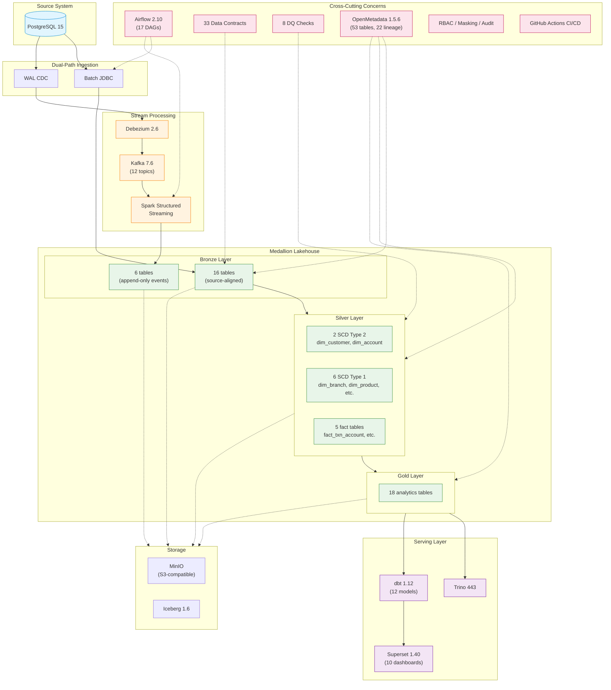

# Banking Data Platform — Architecture

## System Architecture



## Data Flow Summary

### Batch Path (End-to-End)

```
PostgreSQL → Spark JDBC → Bronze Batch (16) → Silver (13) → Gold (18) → Trino/dbt/Superset
```

### CDC Path (Current)

```
PostgreSQL → Debezium → Kafka → Spark Streaming → Bronze CDC (6)
```

> **Note**: CDC consolidation from Bronze CDC to Silver current-state tables is a planned enhancement (P1 in roadmap).

## Key Numbers

| Layer | Count | Description |
|-------|-------|-------------|
| Bronze Batch | 16 | Source-aligned raw tables |
| Bronze CDC | 6 | Append-only change events |
| Silver Dimensions | 8 | 2 SCD Type 2 + 6 SCD Type 1 |
| Silver Facts | 5 | Enriched with dimension keys |
| Gold Marts | 18 | Analytics-ready business products |
| dbt Models | 12 | Semantic layer with tests |
| Airflow DAGs | 17 | Orchestration workflows |
| Data Contracts | 33 | Schema validation |
| DQ Checks | 8 | Quality monitoring |
| OpenMetadata Tables | 53 | Cataloged with lineage |

## Technology Stack

| Component | Version | Role |
|-----------|---------|------|
| PostgreSQL | 15 | Source OLTP database |
| Apache Spark | 3.5.3 | Batch + streaming compute |
| Apache Iceberg | 1.6 | ACID table format |
| MinIO | latest | S3-compatible object storage |
| Iceberg REST Catalog | 1.6 | Shared catalog (Spark + Trino) |
| Trino | 443 | Interactive SQL query engine |
| Apache Airflow | 2.10.0 | Workflow orchestration |
| Debezium | 2.6 | Change Data Capture |
| Apache Kafka | 7.6 | Event streaming |
| OpenMetadata | 1.5.6 | Catalog, lineage, governance |
| dbt Core | 1.12.0 | Semantic models + tests |
| Apache Superset | 1.40.0 | Analytics dashboards |
| Docker Compose | — | Local deployment |

## Port Mapping

| Service | Host Port | Internal Port |
|---------|-----------|---------------|
| PostgreSQL | 5432 | 5432 |
| Spark Master | 9090 | 8080 |
| Spark Worker | 9091 | 8081 |
| Trino | 8085 | 8085 |
| Kafka UI | 8081 | 8080 |
| Airflow | 8080 | 8080 |
| OpenMetadata | 8585 | 8585 |
| Superset | 8088 | 8088 |
| MinIO Console | 9001 | 9001 |

## Related

- [[development-roadmap]] — Next steps: P0 Documentation, P1 CDC Consolidation
- [[cdc-pipeline]] — CDC implementation details
- [[banking-platform]] — Full technology configuration
