# Banking Data Platform — Architecture

> **Portfolio baseline:** `portfolio-v1.1`  
> **Architecture style:** production-like local data platform  
> **Primary patterns:** Medallion Lakehouse, Batch + CDC, SCD Type 1/2, append-only CDC, current-state consolidation, governance, observability, and failure isolation.

---

## 1. Architecture Overview

The Banking Data Platform is a production-like local data engineering platform built around two independent ingestion paths:

1. **Scheduled Batch Analytics**
2. **Near-Real-Time Change Data Capture (CDC)**

Both paths originate from PostgreSQL, which remains the **operational source of truth**, but produce different derived representations for different downstream requirements.

The batch path produces historical analytical models and Gold business marts, while the CDC path preserves append-only change history and incrementally derives selected customer/account current-state tables.

### Core architecture boundary

```text
BATCH

PostgreSQL
    ↓
Spark JDBC
    ↓
Bronze Batch
    ↓
Spark Transformations
    ↓
Silver SCD1/SCD2 + Facts
    ↓
Spark Business Transformations
    ↓
Historical Gold  (10 tables, partitioned by cob_dt)
    ↓
dbt build --select tag:serving   (executed through Trino)
    ↓
iceberg.serving  (9 tables, one cob_dt snapshot)
    ↓
Trino
    ↓
SQL consumers


CDC

PostgreSQL WAL
    ↓
Debezium
    ↓
Kafka
    ↓
Spark Structured Streaming
    ↓
CDC Validation
   /             \
valid           invalid
  ↓                ↓
Bronze CDC         DLQ
  ↓
CDC Consolidation
  ↓
Silver Current
├── Customer
└── Account
```

> **Important:** `Silver Current` does **not** currently feed Gold.  
> Gold analytics remain batch-derived in the `portfolio-v1.1` architecture.

---

# 2. System Architecture

```mermaid
flowchart LR

    %% =========================================================
    %% SOURCE
    %% =========================================================

    subgraph Source["Source Systems"]
        PG["PostgreSQL 15<br/>Operational Source of Truth<br/>16 Source Datasets"]
    end

    %% =========================================================
    %% INGESTION / PROCESSING
    %% =========================================================

    subgraph BatchIngestion["Scheduled Batch Processing"]
        JDBC["Spark JDBC<br/>YAML-Driven ETL"]
        BST["Spark<br/>Silver Transformations"]
        GST["Spark<br/>Gold Transformations"]
    end

    subgraph CDCProcessing["Near-Real-Time CDC Processing"]
        WAL["PostgreSQL WAL"]
        DEB["Debezium 2.6<br/>3 Connectors"]
        KAF["Kafka<br/>12 CDC Topics"]
        SSS["Spark Structured<br/>Streaming"]
        VAL{"CDC<br/>Validation"}
        CON["Config-Driven<br/>CDC Consolidation<br/><br/>Deduplication<br/>Watermark: timestamp + batch id<br/>(not partition-aware)<br/>Idempotent Iceberg MERGE"]
        DLQ["CDC Dead Letter Queue<br/><br/>Raw Payload<br/>Error Context<br/>Kafka Metadata"]
    end

    %% =========================================================
    %% LAKEHOUSE
    %% =========================================================

    subgraph Lakehouse["Apache Iceberg Lakehouse on MinIO — S3-Compatible Object Storage"]

        subgraph Bronze["Bronze Layer"]
            BB["Bronze Batch<br/>16 Source Tables"]
            BC["Bronze CDC<br/>6 Append-Only Tables<br/><br/>INSERT / UPDATE / DELETE / SNAPSHOT"]
        end

        subgraph Silver["Silver Layer"]
            SA["Silver Analytical<br/><br/>8 Dimensions<br/>2 SCD Type 2<br/>6 SCD Type 1<br/>5 Fact Tables"]
            SC["Silver Current-State<br/><br/>dim_customer_current — 10K<br/>dim_account_current — 30K"]
        end

        subgraph Gold["Gold Layer"]
            GA["Historical Gold<br/>10 Tables — partitioned by cob_dt<br/><br/>Customer 360<br/>RFM<br/>Rule-Based Churn Risk<br/>Cross-Sell<br/>Campaign Analytics<br/>Customer Balance / AUM"]
        end

        subgraph ServingLayer["Serving Layer"]
            SV["iceberg.serving<br/>9 dbt-managed Tables<br/><br/>Single cob_dt snapshot<br/>Owned by dbt, not Spark"]
        end
    end

    %% =========================================================
    %% SERVING
    %% =========================================================

    subgraph Serving["Query, Transformation & Analytics"]
        TRINO["Trino<br/>Interactive SQL Query Engine"]
        DBT["dbt<br/>Serving Publisher<br/>9 Models + Tests"]
    end

    %% =========================================================
    %% ORCHESTRATION
    %% =========================================================

    subgraph Orchestration["Orchestration"]
        AF["Apache Airflow<br/>16 DAGs"]
        MAINT["Iceberg<br/>Maintenance"]
    end

    %% =========================================================
    %% GOVERNANCE
    %% =========================================================

    subgraph Governance["Governance, Data Quality & Security"]
        CTR["Data Contracts<br/>33"]
        DQ["Data Quality Checks<br/>8"]
        OM["OpenMetadata<br/>53 Production Data Tables<br/>22 Lineage Edges"]
        SEC["Security & Governance<br/>RBAC<br/>Column Masking<br/>PII Controls<br/>Audit Trail"]
    end

    %% =========================================================
    %% OBSERVABILITY
    %% =========================================================

    subgraph Observability["CDC Observability"]
        FEX["CDC Freshness Exporter"]
        PRM["Prometheus<br/>15s Scrape"]
        GRF["Grafana<br/>CDC Pipeline Dashboard"]
    end

    %% =========================================================
    %% CI/CD
    %% =========================================================

    subgraph Engineering["CI/CD & Engineering"]
        DEV["Developer"]
        GH["GitHub"]
        GHA["GitHub Actions"]
        TEST["Tests / Validation<br/>472 Automated Tests"]
        DOCKER["Docker Compose"]
    end

    %% =========================================================
    %% MAIN DATA FLOW — BATCH
    %% =========================================================

    PG --> JDBC
    JDBC --> BB
    BB --> BST
    BST --> SA
    SA --> GST
    GST --> GA

    %% =========================================================
    %% MAIN DATA FLOW — CDC
    %% =========================================================

    PG --> WAL
    WAL --> DEB
    DEB --> KAF
    KAF --> SSS
    SSS --> VAL

    VAL -->|valid| BC
    VAL -.->|invalid| DLQ

    BC --> CON
    CON --> SC

    %% =========================================================
    %% SERVING
    %% =========================================================

    GA --> DBT
    DBT -->|dbt build --select tag:serving, via Trino| SV
    SV --> TRINO
    GA -.->|ad-hoc / historical queries| TRINO

    %% =========================================================
    %% ORCHESTRATION
    %% =========================================================

    AF -.-> JDBC
    AF -.-> BST
    AF -.-> GST
    AF -.-> DBT
    AF -.-> CON
    AF -.-> DQ
    AF -.-> MAINT

    %% =========================================================
    %% GOVERNANCE / METADATA
    %% =========================================================

    CTR -.-> BB
    CTR -.-> BC
    CTR -.-> SA
    CTR -.-> SC

    DQ -.-> SA
    DQ -.-> SC
    DQ -.-> GA

    OM -.-> BB
    OM -.-> BC
    OM -.-> SA
    OM -.-> SC
    OM -.-> GA

    SEC -.-> TRINO
    SEC -.-> SA
    SEC -.-> GA

    %% =========================================================
    %% OBSERVABILITY
    %% =========================================================

    SC -.-> TRINO
    TRINO -.->|freshness SQL queries| FEX
    FEX --> PRM
    PRM --> GRF

    %% =========================================================
    %% CI/CD
    %% =========================================================

    DEV --> GH
    GH --> GHA
    GHA --> TEST
    TEST --> DOCKER

    GHA -.-> AF

    %% =========================================================
    %% STYLING
    %% =========================================================

    classDef source fill:#e0e0e0,stroke:#616161,color:#000
    classDef batch fill:#bbdefb,stroke:#1565c0,color:#000
    classDef cdc fill:#ffe0b2,stroke:#ef6c00,color:#000
    classDef bronze fill:#d7ccc8,stroke:#5d4037,color:#000
    classDef silver fill:#f5f5f5,stroke:#9e9e9e,color:#000
    classDef gold fill:#fff9c4,stroke:#f9a825,color:#000
    classDef serving fill:#e1bee7,stroke:#7b1fa2,color:#000
    classDef governance fill:#b2dfdb,stroke:#00796b,color:#000
    classDef observability fill:#c8e6c9,stroke:#2e7d32,color:#000
    classDef dlq fill:#ffcdd2,stroke:#c62828,color:#000
    classDef cicd fill:#c5cae9,stroke:#283593,color:#000

    class PG source

    class JDBC,BST,GST,AF,MAINT batch

    class WAL,DEB,KAF,SSS,VAL,CON cdc
    class DLQ dlq

    class BB,BC bronze
    class SA,SC silver
    class GA gold

    class TRINO,DBT serving

    class CTR,DQ,OM,SEC governance

    class FEX,PRM,GRF observability

    class DEV,GH,GHA,TEST,DOCKER cicd
```



---

# 3. Source System

PostgreSQL 15 is the operational source of truth for the platform.

The source environment contains **16 banking datasets** across several domains.

### Core Banking

- Customer
- Account
- Transaction
- Branch
- Product
- Loan
- Deposit

### Card / CRM

- Card
- Card Transaction
- CRM Interaction

### Digital Banking / Operations

- Online Transaction
- Device
- Support Ticket
- Location
- Employee
- MCC Code

The same PostgreSQL source feeds two independent ingestion mechanisms:

```text
PostgreSQL
    ├── Batch JDBC
    └── WAL-based CDC
```

---

# 4. Batch Analytics Path

## 4.1 Flow

```text
PostgreSQL
    ↓
Spark JDBC
    ↓
Bronze Batch
    ↓
Spark Transformations
    ↓
Silver Analytical
    ↓
Spark Business Transformations
    ↓
Gold Analytics
    ↓
Trino
    ↓
SQL consumers
```

The batch path is responsible for the historical analytical model and Gold business marts.

### Ingestion characteristics

- YAML-driven source configuration
- JDBC-based extraction
- Schema validation
- Reusable Spark ETL jobs
- Airflow orchestration
- Apache Iceberg tables on MinIO

---

## 4.2 Bronze Batch

Bronze Batch represents the batch-ingested source datasets before analytical modeling.

```text
PostgreSQL Source
      ↓
Spark JDBC
      ↓
Bronze Batch
```

The layer preserves source-aligned structures suitable for downstream cleansing, standardization, backfills, and replay of scheduled ETL.

---

## 4.3 Silver Analytical Model

The batch Silver layer contains:

- **8 dimensions**
  - 2 SCD Type 2
  - 6 SCD Type 1
- **5 fact tables**

### SCD Type 2

- `dim_customer`
- `dim_account`

### SCD Type 1

- `dim_branch`
- `dim_product`
- `dim_card`
- `dim_employee`
- `dim_device`
- `dim_location`

### Fact Tables

- `fact_txn_account`
- `fact_card_txn`
- `fact_online_transaction`
- `fact_crm_interaction`
- `fact_support_ticket`

The analytical Silver model contains more than **4.6M curated financial transaction records** across the main financial transaction facts.

### Historical semantics

SCD Type 2 answers questions such as:

> **What was true at a point in time?**

Example:

```text
customer_id = 1001

Version 1
segment = MASS
valid_from = Jan
valid_to = Jun

Version 2
segment = PRIORITY
valid_from = Jul
valid_to = current
```

This representation is appropriate for historical and point-in-time analytics.

---

# 5. Gold Analytics Layer

Gold tables are produced from the **batch Silver analytical model**.

The current portfolio baseline contains:

- **10 historical Gold tables** — Spark-managed, partitioned by `cob_dt`
- **9 current-serving tables** — dbt-managed in `iceberg.serving`, published
  through Trino

The 8 `gold.*_current` CTAS tables and the Spark-only
`mart_customer_360_current` view were retired. The CTAS tables were created once
at initialization and never refreshed; the Spark view was not visible through
Trino, which is the serving engine.

Representative analytical outputs include:

- Customer 360
- RFM Segmentation
- Rule-Based Churn-Risk Scoring
- Cross-Sell Analytics
- Campaign Analytics
- Customer Balance / AUM Analytics
- Customer Product Summaries
- Customer Transaction Summaries
- Branch-Level Analytics

The Gold layer serves business-facing analytical use cases rather than raw operational processing.

> **Architecture boundary:** Gold is currently batch-derived.  
> CDC-derived Silver Current tables do not directly feed Gold.

---

# 6. CDC / Streaming Path

## 6.1 Flow

```text
PostgreSQL WAL
    ↓
Debezium
    ↓
Kafka
    ↓
Spark Structured Streaming
    ↓
CDC Validation
   /             \
valid           invalid
  ↓                ↓
Bronze CDC         DLQ
  ↓
CDC Consolidation
  ↓
Silver Current-State
```

The CDC path captures row-level changes without repeatedly scanning source tables.

### Components

- PostgreSQL WAL
- Debezium 2.6
- 3 Debezium connectors
- 12 Kafka CDC topics
- Spark Structured Streaming
- 6 append-only Bronze CDC tables
- CDC validation / DLQ
- Config-driven current-state consolidation

---

# 7. Bronze CDC

Bronze CDC is an **append-only change-history layer**.

It stores change events such as:

```text
SNAPSHOT
INSERT
UPDATE
DELETE
```

rather than continuously overwriting existing records.

### Verified Bronze CDC datasets

- `core_customer_cdc`
- `core_account_cdc`
- `core_transaction_cdc`
- `card_account_cdc`
- `card_transaction_cdc`
- `online_transaction_cdc`

The CDC records retain processing/source metadata including concepts such as:

- CDC operation
- Event timestamp
- Kafka topic
- Kafka partition
- Kafka offset
- Spark batch ID

### Purpose

Bronze CDC acts as the:

> **Audit + replay boundary**

For example:

```text
customer_id = 1001

09:00 SNAPSHOT email=a@example.com
10:00 UPDATE   email=b@example.com
11:00 UPDATE   email=c@example.com
```

All events remain available in Bronze CDC.

Bronze CDC and Bronze Batch are therefore different representations:

```text
Bronze Batch
= scheduled source-aligned data

Bronze CDC
= append-only technical change history
```

---

# 8. CDC Validation & Dead Letter Queue

CDC events are validated before being persisted into Bronze CDC.

The validation module checks three primary conditions:

1. `__op` is present and one of `c/u/d/r`
2. `__ts_ms` is numeric / parseable
3. payload is non-null

### Flow

```text
Kafka CDC Event
      ↓
Validation
   /          \
valid        invalid
  ↓             ↓
Bronze CDC     CDC DLQ
```

The Iceberg DLQ table stores fields such as:

```text
source_topic
entity
raw_payload
error_type
error_message
event_timestamp
kafka_partition
kafka_offset
kafka_timestamp
failed_at
spark_batch_id
```

### Verified runtime test

```text
5 valid events
    ↓
Bronze CDC

2 invalid events
    ↓
CDC DLQ

Streaming micro-batch completed without crashing.
```

The two invalid test events included:

- missing `__op`
- unsupported `__op = x`

The design isolates malformed events while allowing valid records to continue processing.

---

# 9. CDC Consolidation

Bronze CDC contains change history, but many downstream consumers require one latest record per business key.

The platform therefore includes a generic, configuration-driven CDC consolidation engine.

```text
Bronze CDC
    ↓
Incremental Read
    ↓
Deduplication
    ↓
Operation Handling
    ↓
Iceberg MERGE
    ↓
Silver Current-State
```

### Implementation

Primary engine:

```text
code_etl/cdc/consolidation/cdc_consolidation.py
```

Entity configuration:

```text
cdc_consolidation_customer.yml
cdc_consolidation_account.yml
```

The same consolidation engine is reused across multiple entities by changing YAML configuration rather than copying entity-specific processing code.

---

## 9.1 Consolidation Responsibilities

The engine performs:

- incremental CDC reads
- business-key deduplication
- persisted progress tracking
- INSERT handling
- UPDATE handling
- DELETE handling
- SNAPSHOT handling
- Iceberg MERGE
- restart-safe reprocessing

---

# 10. Composite Watermark Design

The consolidation process persists processing progress in:

```text
meta.cdc_watermark
```

Conceptual schema:

```sql
CREATE TABLE meta.cdc_watermark (
    table_name           VARCHAR,
    kafka_topic          VARCHAR,
    kafka_partition      INTEGER,
    last_cdc_timestamp   TIMESTAMP(6) WITH TIME ZONE,
    last_kafka_offset    BIGINT,
    last_processed_at    TIMESTAMP(6) WITH TIME ZONE
);
```

The logical watermark identity is:

```text
table_name
+ kafka_topic
+ kafka_partition
```

This is important because Kafka offsets are only meaningful **within an individual partition**.

Example:

```text
customer_topic / partition 0 → offset 1500
customer_topic / partition 1 → offset 921
```

Offset `1500` in partition 0 cannot be globally compared with offset `921` in partition 1 to determine which event is newer.

The watermark therefore tracks progress independently per partition.

### What the watermark provides

- incremental processing
- restart recovery
- partition-specific progress tracking
- reduced unnecessary rescans
- replay-safe failure recovery

### What it does not provide

The watermark does **not** create global ordering across Kafka partitions.

Kafka ordering remains partition-local.

---

# 11. Deduplication & Event Ordering

Within an incremental consolidation batch, the latest event for each business key is selected before MERGE.

Event ordering uses persisted CDC event metadata and Kafka partition-local progress.

The objective is:

```text
Multiple changes for the same business key
             ↓
       Deduplication
             ↓
One latest event/state
             ↓
        Iceberg MERGE
```

Example:

```text
customer 1001 → UPDATE email=a
customer 1001 → UPDATE email=b
customer 1001 → UPDATE email=c
```

After deduplication:

```text
customer 1001 → email=c
```

### Ordering limitation

Kafka guarantees ordering within a partition, not across all partitions.

The current architecture therefore does not claim globally deterministic ordering across unrelated Kafka partitions.

---

# 12. Idempotent Iceberg MERGE

The consolidation engine uses operation-aware Iceberg MERGE semantics.

Conceptually:

```text
MATCHED + DELETE
    → DELETE target row

MATCHED + INSERT/UPDATE/SNAPSHOT
    → UPDATE target row

NOT MATCHED + non-DELETE
    → INSERT target row
```

Example:

```text
Silver Current:

customer_id = 1001
email = old@example.com
```

CDC:

```text
customer_id = 1001
email = new@example.com
operation = UPDATE
```

After MERGE:

```text
customer_id = 1001
email = new@example.com
```

---

## 12.1 Failure Recovery

The watermark is advanced only after successful current-state processing.

Conceptually:

```text
Read CDC Events
      ↓
Deduplicate
      ↓
MERGE Silver
      ↓
Success?
      ↓
Update Watermark
```

Consider the failure window:

```text
Silver MERGE succeeds
        ↓
Process crashes
        ↓
Watermark is not updated
```

After restart:

```text
Old watermark
    ↓
Same events read again
    ↓
Idempotent MERGE
    ↓
Same final Silver state
    ↓
Watermark advances
```

This produces replay-safe processing without duplicate current-state rows.

### Semantics

The project claims:

> **Checkpointed, replay-safe, idempotent processing**

It does **not** claim:

> end-to-end exactly-once semantics.

Exactly-once behavior has not been proven as one coordinated commit protocol across PostgreSQL, Debezium, Kafka, Spark, Bronze, Silver, and the watermark table.

---

# 13. Silver Current-State

The current CDC consolidation scope contains two entities.

| Bronze CDC Source          | Silver Current Target         | Verified Rows |
| -------------------------- | ----------------------------- | ------------: |
| `bronze.core_customer_cdc` | `silver.dim_customer_current` |        10,000 |
| `bronze.core_account_cdc`  | `silver.dim_account_current`  |        30,000 |

Current-state semantics are:

```text
1 business key
      ↓
1 latest row
```

For example:

```text
customer_id | email             | segment
------------|-------------------|---------
1001        | user@example.com  | PRIORITY
```

Silver Current answers:

> **What is true now?**

---

# 14. Silver SCD2 vs Silver Current

These tables intentionally represent different analytical contracts.

| Property              | Silver SCD2           | Silver Current            |
| --------------------- | --------------------- | ------------------------- |
| Source path           | Batch                 | CDC                       |
| Primary purpose       | Historical analytics  | Latest consolidated state |
| Rows per business key | Multiple versions     | One row                   |
| History retained      | Yes                   | No, current state only    |
| Typical question      | What was true then?   | What is true now?         |
| Freshness             | Batch-cycle dependent | CDC-derived               |
| Example               | `dim_customer`        | `dim_customer_current`    |

Example:

### SCD Type 2

```text
customer_sk | customer_id | segment   | valid_from | valid_to | is_current
------------|-------------|-----------|------------|----------|-----------
SK01        | 1001        | MASS      | Jan        | Jun      | 0
SK02        | 1001        | PRIORITY  | Jul        | NULL     | 1
```

### Current State

```text
customer_id | segment
------------|---------
1001        | PRIORITY
```

Both are derived representations.

Neither replaces PostgreSQL as the operational source of truth.

---

# 15. CDC Freshness Verification

Five local runtime trials measured the elapsed time from a PostgreSQL source change until the corresponding value was observable in the Silver current-state table.

### Methodology

```text
t0 = PostgreSQL COMMIT of an UPDATE to core_banking.customer
t1 = the new value is readable in silver.dim_customer_current, queried via Trino
```

`t1` is taken at the consumer-facing table through the query engine, so the
measurement includes the wait for the next scheduled consolidation run. That
wait dominates the result and is the point: it is the delay a consumer sees.

Consolidation runs on `*/10 * * * *`. Trials run back to back do **not** sample
the position of the commit within that window randomly — each trial ends exactly
when a consolidation run completes, so the next commits at offset ~0 and waits
almost a full window (observed: 355s, 596s, 599s against a 600s cadence). Trials
below are therefore separated by a uniform random sleep over `[0, cadence)`.

|      Trial | E2E Source → Silver |
| ---------: | ------------------: |
|          1 |              546.9s |
|          2 |               65.9s |
|          3 |              409.8s |
|          4 |              255.0s |
|          5 |              576.2s |
| **Median** |          **409.8s** |

### Result

```text
Range   : 65.9–576.2 seconds
Median  : 409.8 seconds
Trials  : 5 (all observed)
Cadence : 600 seconds (*/10 * * * *)
```

> **Canonical claim:**  
> Measured local PostgreSQL-to-Silver-Current CDC freshness: median 409.8s
> across 5 trials (range 65.9–576.2s) at a 600s consolidation cadence.

This is a local verification benchmark, not a production SLA. The latency is a
scheduling choice, not a pipeline limit — the consolidation job itself finishes
in roughly 30 seconds. Changing the cadence changes the number and invalidates
this measurement.

Measured on `portfolio-v1.1`. The `v1.0` figure (49.8s median) is not comparable:
it ran consolidation manually right after the source `UPDATE`, so it timed
processing only, and it predates the fix to `cdc_consolidation_pipeline`, which
had been submitting Spark from the Airflow container — a container with no
Iceberg jars — so consolidation had never run from Airflow at all.

---

# 16. Serving & Analytics

Gold analytical tables are queried using Trino.

```text
Historical Gold (Spark, 10 tables)
        ↓
   dbt via Trino
        ↓
iceberg.serving.* (9 tables)
        ↓
Trino ──┬── SQL consumers
        ├── Streamlit
        └── SQL consumers
```

### Responsibility boundary

```text
Spark
= Bronze → Silver → historical Gold

dbt + Trino
= current-serving layer
```

dbt acts as the **serving publisher**, not the primary transformation engine.
The platform contains **9 dbt serving models**. The previous 12 `sm_*` semantic
models were removed: all were pure passthroughs and all were `ephemeral`, so
they created no queryable object — declaring that consumers depended on them
described a path that did not exist.

Serving models are `materialized: table`, not views: the Trino Iceberg REST
catalog does not support `createView`. Each model filters on an explicit
`cob_dt` passed as a dbt var rather than `MAX(cob_dt)`, so a missing snapshot
fails the build instead of silently serving stale data.

### Catalog naming

The same Iceberg warehouse has two engine-local names:

```text
Spark → lakehouse    (spark-defaults.conf, used in every ETL YAML)
Trino → iceberg      (from init_trino/catalog/iceberg.properties)
```

### Publication contract

```text
GOLD_COMPLETE(cob_dt)
        ↓
serving publisher DAG   ← waits for the flag for the SAME cob_dt
        ↓
dbt build --select serving --vars cob_dt
        ↓
snapshot + grain tests
        ↓
SERVING_COMPLETE(cob_dt)
```

Both failure paths are enforced: without `GOLD_COMPLETE` the publisher does not
run, and a failing `dbt build` leaves `SERVING_COMPLETE` unwritten.

---

# 17. Airflow Orchestration

Apache Airflow coordinates scheduled and job-oriented workflows.

```text
Apache Airflow
16 DAGs
```

Representative orchestration responsibilities include:

- batch ingestion
- Silver transformations
- Gold transformations
- CDC consolidation
- data-quality jobs
- Iceberg maintenance
- supporting operational workflows

Airflow uses control/orchestration relationships rather than acting as an event processor.

### Important distinction

```text
Kafka
   ↓
Spark Structured Streaming
```

is the continuous CDC processing path.

Airflow does **not** process individual Kafka events.

---

# 18. Governance & Data Quality

Governance is implemented as a cross-cutting platform capability rather than part of the physical data flow.

## Data Contracts

```text
33 data contracts
```

Used to define expected structures and quality expectations between source and curated data.

---

## Data Quality

```text
8 data-quality checks
```

Applied across analytical pipelines to detect invalid or unexpected data states.

---

## OpenMetadata

The platform catalogs:

```text
53 production data tables
22 lineage edges
```

Capabilities include:

- metadata catalog
- lineage
- glossary / business metadata
- ownership/context
- searchable data assets

---

## Security & Governance

Implemented controls include:

- RBAC
- column masking
- PII controls
- audit trail

These controls help demonstrate governance patterns without claiming full banking regulatory compliance.

---

# 19. Observability Architecture

The platform includes lightweight CDC freshness observability.

```text
Silver Current / Trino
        ↓
CDC Freshness Exporter
        ↓
Prometheus
        ↓
Grafana
```

### Components

- Custom Python freshness exporter
- Prometheus
- Grafana
- Trino SQL queries

### Ports

```text
Freshness Exporter : 9119
Prometheus         : 9095
Grafana            : 3000
```

Prometheus scrapes exporter metrics every **15 seconds**.

---

# 20. Observability Metrics

| Metric                               | Description                             |
| ------------------------------------ | --------------------------------------- |
| `cdc_freshness_seconds{table="..."}` | Age since latest consolidated CDC state |
| `cdc_row_count{table="..."}`         | Current Silver table row count          |
| `cdc_recent_events`                  | Recent CDC activity                     |
| `exporter_up`                        | Exporter / Trino reachability signal    |

The exporter queries Trino and exposes the results in Prometheus format.

---

# 21. Grafana Dashboard

The `Banking Data Platform — CDC Pipeline` dashboard contains eight panels.

|   # | Panel                       | Type        |
| --: | --------------------------- | ----------- |
|   1 | Trino Up / Down             | Stat        |
|   2 | Customer Current-State Rows | Stat        |
|   3 | Account Current-State Rows  | Stat        |
|   4 | Recent CDC Events           | Stat        |
|   5 | CDC Freshness Over Time     | Time Series |
|   6 | Customer Freshness Now      | Stat        |
|   7 | Account Freshness Now       | Stat        |
|   8 | Table Row Count Over Time   | Time Series |

The current visualization uses a red threshold at:

```text
3600 seconds = 1 hour
```

This threshold flags **stale CDC-derived data that warrants investigation**.

It should not be interpreted as proof by itself that the pipeline has stalled.

---

## 21.1 Freshness Metric Limitation

The current freshness metric is primarily a **data-age metric**.

For example:

```text
Latest Silver event = 08:00
Current time        = 11:00

Freshness age       = 3 hours
```

This can happen for two very different reasons.

### Case A — Source is idle

```text
Bronze latest = 08:00
Silver latest = 08:00
```

The pipeline is fully caught up.

### Case B — Pipeline is behind

```text
Bronze latest = 10:59
Silver latest = 08:00
```

The downstream CDC path is significantly behind.

A production extension would therefore complement data-age monitoring with metrics such as:

```text
latest Bronze event
-
latest Silver processed event
```

and Kafka consumer lag.

The current portfolio implementation intentionally keeps observability lightweight.

---

# 22. CI/CD & Testing

The project includes GitHub Actions-based CI/CD.

```text
Developer
    ↓
GitHub
    ↓
GitHub Actions
    ↓
Tests / Validation
    ↓
Docker Compose
```

The repository contains three primary workflow categories:

- CI / lint / test
- integration tests
- benchmark / performance validation

### Automated Testing

```text
312 automated tests
```

covering areas such as:

- ETL
- transformations
- data quality
- governance
- pipeline behavior

CI/CD is an engineering control plane and is not part of the runtime data path.

---

# 23. Key Numbers

| Category          | Metric                         | Verified Value |
| ----------------- | ------------------------------ | -------------: |
| **Source**        | Source datasets                |             16 |
| **Bronze**        | Batch tables                   |             16 |
|                   | CDC tables                     |              6 |
| **Silver**        | SCD Type 2 dimensions          |              2 |
|                   | SCD Type 1 dimensions          |              6 |
|                   | Fact tables                    |              5 |
|                   | CDC current-state tables       |              2 |
| **Gold**          | Analytics tables               |             18 |
| **Scale**         | Curated financial transactions |          4.6M+ |
| **CDC**           | Debezium connectors            |              3 |
|                   | Kafka CDC topics               |             12 |
| **Serving**       | dbt models                     |             12 |
| **Governance**    | Data contracts                 |             33 |
|                   | Data-quality checks            |              8 |
| **Catalog**       | Production data tables         |             53 |
|                   | Lineage edges                  |             22 |
| **Orchestration** | Airflow DAGs                   |             16 |
| **Testing**       | Automated tests                |            472 |
| **Platform**      | Docker services                |             24 |
| **CDC Current**   | Customer rows                  |         10,000 |
|                   | Account rows                   |         30,000 |
| **CDC Freshness** | Median local E2E               |         409.8s |
|                   | Local E2E range                |    65.9–576.2s |
|                   | Consolidation cadence          |           600s |

---

# 24. Technology Stack

| Component            | Version / Distribution | Role                               |
| -------------------- | ---------------------- | ---------------------------------- |
| PostgreSQL           | 15                     | Operational source database        |
| Apache Spark         | 3.5.3                  | Batch and streaming processing     |
| Apache Iceberg       | 1.6.0                  | Lakehouse table format             |
| MinIO                | Repository image       | S3-compatible object storage       |
| Iceberg REST Catalog | 1.6.x                  | Shared Iceberg catalog             |
| Trino                | 443                    | Interactive SQL query engine       |
| Apache Airflow       | 2.10.0                 | Workflow orchestration             |
| Debezium             | 2.6                    | Change Data Capture                |
| Confluent Platform   | 7.6                    | Kafka distribution / CDC transport |
| Apache Kafka Broker  | 3.6.x                  | Event streaming                    |
| OpenMetadata         | 1.5.6                  | Catalog, lineage, governance       |
| dbt Core             | Repository-pinned      | Gold semantic models and tests     |
| Prometheus           | Repository-pinned      | Metrics collection                 |
| Grafana              | Repository-pinned      | Metrics visualization              |
| Docker Compose       | —                      | Local platform deployment          |

> `Confluent Platform 7.6` should not be described as `Apache Kafka 7.6`.  
> The Kafka broker version belongs to the Kafka 3.x version family.

---

# 25. Port Mapping

| Service                    | Host Port | Internal Port | URL                           |
| -------------------------- | --------: | ------------: | ----------------------------- |
| PostgreSQL                 |      5432 |          5432 | —                             |
| MinIO Console              |      9001 |          9001 | http://localhost:9001         |
| Spark Master UI            |      9090 |          8080 | http://localhost:9090         |
| Spark Worker UI            |      9091 |          8081 | http://localhost:9091         |
| Airflow                    |      8080 |          8080 | http://localhost:8080         |
| Kafka UI                   |      8081 |          8080 | http://localhost:8081         |
| Debezium / Kafka Connect   |      8083 |          8083 | http://localhost:8083         |
| Trino                      |      8085 |          8080 | http://localhost:8085         |
| Iceberg REST               |      8181 |          8181 | http://localhost:8181         |
| OpenMetadata               |      8585 |          8585 | http://localhost:8585         |
| Streamlit                  |      8501 |          8501 | http://localhost:8501         |
| Prometheus                 |      9095 |          9090 | http://localhost:9095         |
| Grafana                    |      3000 |          3000 | http://localhost:3000         |
| Freshness Exporter         |      9119 |          9119 | http://localhost:9119/metrics |
| Zookeeper                  |      2181 |          2181 | —                             |
| Kafka                      |      9092 |          9092 | —                             |
| OpenMetadata MySQL         |      3307 |          3306 | —                             |
| OpenMetadata Elasticsearch |      9200 |          9200 | —                             |

---

# 26. Key Implementation Files

## CDC Streaming

```text
code_etl/cdc/base_job/cdc_streaming.py
code_etl/cdc/base_job/cdc_dlq.py
```

## CDC Consolidation

```text
code_etl/cdc/consolidation/cdc_consolidation.py
code_etl/cdc/consolidation/config/cdc_consolidation_customer.yml
code_etl/cdc/consolidation/config/cdc_consolidation_account.yml
```

## Silver Current DDL

```text
docker/init_iceberg/06_ddl_silver_cdc_current.sql
```

## Airflow

```text
airflow/dags/cdc/cdc_consolidation_dag.py
```

## Observability

```text
docker/monitoring/exporters/freshness_exporter.py
docker/monitoring/exporters/Dockerfile
docker/monitoring/prometheus.yml
docker/monitoring/grafana/dashboards/banking-platform.json
docker/monitoring/grafana/provisioning/
```

## Evidence

```text
docs/evidence/
docs/evidence/p1-cdc-consolidation/
docs/evidence/p2-observability/
```

---

# 27. Current Architecture Boundaries

The project intentionally documents its current limits rather than presenting the local environment as a production banking deployment.

## 27.1 CDC stops at Silver Current

Current architecture:

```text
Bronze CDC
    ↓
CDC Consolidation
    ↓
Silver Current
```

Not:

```text
Silver Current
    ↓
Gold
```

Gold remains batch-derived.

---

## 27.2 Current-State CDC scope is selective

Only two CDC entities are currently consolidated into Silver Current:

```text
Customer
Account
```

Other CDC datasets remain append-only Bronze change history.

---

## 27.3 No end-to-end exactly-once claim

The platform uses:

- Spark checkpoints
- persisted watermarks
- deduplication
- replay-safe processing
- idempotent Iceberg MERGE

The system can safely reprocess data after certain failures, but this is not presented as one globally coordinated exactly-once transaction across all components.

---

## 27.4 Kafka ordering is partition-local

Kafka offsets provide ordering within a partition.

They do not provide global ordering across different partitions.

Composite watermarks therefore track progress per partition rather than comparing offsets globally.

---

## 27.5 Local deployment is not highly available

The platform is designed as a production-like local portfolio environment.

It does not currently demonstrate full production capabilities such as:

- multi-broker Kafka HA
- multi-worker distributed Spark cluster
- Kubernetes orchestration
- multi-region disaster recovery
- enterprise mTLS / KMS integration
- production SLO / incident management
- large-scale capacity testing

These are intentionally outside the `portfolio-v1.1` scope.

---

# 28. Architecture Principles

The platform follows several design principles.

### 1. Keep raw CDC append-only

```text
Bronze CDC
= audit + replay boundary
```

### 2. Separate historical and current-state semantics

```text
Silver SCD2
= historical analytical state

Silver Current
= latest CDC-derived state
```

### 3. Keep PostgreSQL as the operational source of truth

Silver tables are derived representations, not independent authoritative sources.

### 4. Advance watermarks after successful data processing

This prevents loss caused by marking data as processed before its target write succeeds.

### 5. Prefer idempotent replay over unsupported exactly-once claims

The platform is designed so duplicate processing can be handled safely.

### 6. Let Spark own the Medallion transformations

```text
Spark:
Bronze → Silver → Gold
```

dbt is used downstream for curated Gold semantic models and tests.

### 7. Keep control planes separate from data flow

Airflow, OpenMetadata, governance, CI/CD, and observability coordinate or inspect the platform but do not replace the physical data-processing path.

---

# 29. Interview-Ready Architecture Summary

> The platform uses PostgreSQL as the operational source of truth and separates scheduled batch analytics from near-real-time CDC. The batch path uses Spark JDBC to populate an Iceberg Medallion Lakehouse, where Spark builds SCD1/SCD2 dimensions, fact tables, and Gold business marts. In parallel, Debezium captures PostgreSQL WAL changes into Kafka, Spark Structured Streaming validates and persists them as append-only Bronze CDC history, and a config-driven consolidation engine derives customer and account current-state tables using timestamp+batch-id watermarks, deduplication, and idempotent Iceberg MERGE. Trino and dbt handle analytical publication and query access, while Airflow, OpenMetadata, data contracts, data-quality checks, security controls, Prometheus/Grafana, and CI/CD provide cross-cutting platform capabilities.

---

# 30. Portfolio Baseline

```text
P0 ✅ Portfolio Polish
P1 ✅ CDC Consolidation
P2 ✅ Basic Observability
P3 ✅ DLQ / Error Handling
━━━━━━━━━━━━━━━━━━━━━━━━━━━━━━━━━━━━━━
FEATURE FREEZE
━━━━━━━━━━━━━━━━━━━━━━━━━━━━━━━━━━━━━━
portfolio-v1.0
```

The architecture is intentionally frozen at this baseline for portfolio and interview use.

Future additions should only be considered when they close a clear architecture gap or directly support a target role.

---

## Final Architecture Statement

> **Production-like banking data platform combining batch analytics and near-real-time CDC on an Apache Iceberg Lakehouse, with historical and current-state modeling, replay-safe CDC consolidation, orchestration, governance, analytics serving, failure isolation, and data-freshness observability.**

---

# Time Semantics

```text
Storage / engine timezone : UTC
Business timezone         : Asia/Ho_Chi_Minh
Processing date           : explicit cob_dt
Business date             : explicitly derived from UTC timestamps
```

Spark runs with a UTC session timezone, enforced at runtime by
`assert_utc_session()` in `code_etl/shared/spark/spark_session.py`. Banking
calendar dates are derived explicitly rather than inherited from an engine
session:

```sql
-- Spark
CAST(from_utc_timestamp(txn_date, 'Asia/Ho_Chi_Minh') AS DATE)

-- Trino
CAST(txn_date AT TIME ZONE 'Asia/Ho_Chi_Minh' AS DATE)
```

Timestamps are never bulk-converted; they remain UTC instants. Only calendar
dates and months are converted. `cob_dt` is an orchestration date and is
independent of both.

Spark and Trino therefore implement the same business-time contract
independently, rather than agreeing by coincidence because their session
timezones happen to match.

---

# Not Implemented

Stated explicitly so this document is not read as claiming more than the code
does:

| Area | Status |
| ---- | ------ |
| CDC consolidation watermark | `(CDC timestamp, Spark batch id)` per table — **not** partition-aware |
| Kafka topic / partition / offset in valid Bronze CDC | **not** persisted (DLQ path only) |
| Gold from Silver Current | not wired; Gold remains batch-derived |
| Exactly-once semantics | not claimed; processing is checkpointed, replay-safe and idempotent |

---

# Verified Figures

Every count in this document is generated and checked against
[`docs/evidence/metrics-manifest.yaml`](../evidence/metrics-manifest.yaml) by
`scripts/generate_metrics_manifest.py`, and re-checked against README by
`scripts/verify_readme_metrics.py`.
